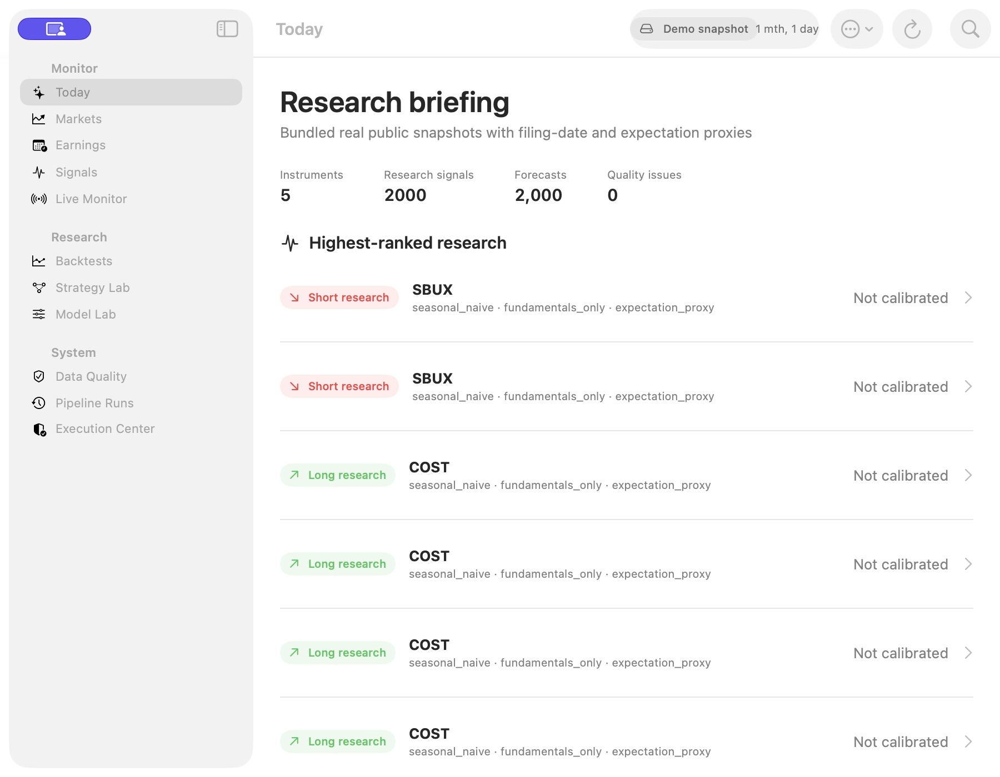

# Nowcaster installed-app user-flow check — 27 September 2026

## Verdict

Incomplete. The installed app opened and its Live Monitor navigation worked, but the current starting state was a month-old demo snapshot with monitoring stopped. This run did not verify the complete day-trading assistant workflow. Do not treat it as an all-markets, trading-lifecycle, or profitability pass.

Target: `/Applications/Nowcaster.app`. User goal: a usable assistant that observes supported markets, explains its strategy and market context, presents a conditional long/short setup with entry, invalidation/stop and targets, and follows the setup through management and exit.

## Steps and observed health

1. **Open installed app — passed, narrowly.** Connected to its normal macOS `Today` window and read its sidebar and menu bar. Nowcaster remained running throughout this check. Dock behavior, fresh-install behavior and relaunch persistence were not tested in this run.
2. **Read the initial briefing — renders, but unsuitable as a current-market briefing.** The toolbar displayed `Demo snapshot` and `1 mth, 1 day`. The screen showed 5 instruments, 2,000 research signals, 2,000 forecasts and 0 quality issues. Visible rows repeated SBUX short research and COST long research, with `seasonal_naive · fundamentals_only · expectation_proxy` and `Not calibrated`. This is the observed demo presentation, not evidence of present-day entries or of an intraday trend strategy. Screenshot: [01-today.png](01-today.png).
3. **Navigate to Live Monitor — navigation passed; collection not tested.** Clicking the sidebar opened `Live Monitor`. Its accessible UI reported `Stopped`, `2 stocks · 2 crypto`, `Confirmed 5-minute decisions · 1-minute risk monitoring`, `Start Monitoring`, and `No Live Events`. Its copy explained that it needed finalized bars and that monitoring stops when the Mac sleeps, goes offline or quits. These are UI claims; provider behavior and bar freshness were not verified in this run.
4. **Inspect live strategies and trade management — blocked.** A Live Monitor screenshot was retained and subsequently visually confirmed: [02-live-monitor-stopped.png](02-live-monitor-stopped.png). Further navigation encountered repeated `Sky Computer Use native pipe closed before response` errors. Resetting the controller, refreshing its inventory and reconnecting to the exact installed app path did not recover control. Strategy Lab, setup detail, entry/stop/target fields, position management, exits and notifications were therefore not exercised.

## Findings tied to the observed steps

- **High impact, step 2:** the first view presents historical earnings research rather than the current-market situation the user is looking for. The date/mode badge provides useful disclosure, but a user should not need to infer why the opening screen is unrelated to today's trading workflow.
- **High impact, step 3:** the visible monitor is stopped, so this app session is not currently showing live-monitor events. The separate prospective study was not inspected or changed; its collector status cannot be inferred from this screen.
- **Medium impact, step 2:** repeated rows do not show dates, horizons or another visible distinction. A user cannot tell why two SBUX rows or four COST rows differ without investigating further.
- **Medium impact, step 2:** internal labels such as `seasonal_naive` and `expectation_proxy` do not explain a trading rationale in beginner-friendly language. The `Not calibrated` disclosure is useful, but the screen does not provide a current trigger or management plan.
- **Accessibility scope:** sidebar rows, the selected page, monitor status and Start Monitoring control were exposed to accessibility inspection. Keyboard navigation, VoiceOver, focus transitions, contrast and complete accessibility compliance were not tested.

## Control-tool failure evidence

The installed Nowcaster process remained alive (PID 77059 at inspection). macOS produced crash reports for `SkyComputerUseService`, not Nowcaster:

- `/Users/james/Library/Logs/DiagnosticReports/SkyComputerUseService-2026-09-27-131739.ips`
- `/Users/james/Library/Logs/DiagnosticReports/SkyComputerUseService-2026-09-27-131750.ips`

The latter reports `EXC_BREAKPOINT` / `SIGTRAP`, with `Array.remove(at:)` and repeated `Sequence.compactMap` frames. This supports a failure in the UI-control service. It does not establish a Nowcaster crash or a cause inside Nowcaster.

## Required continuation

After native control is restored, resume hands-on testing from Live Monitor. Verify current public data, supported/unsupported asset handling, strategy rationale, timestamps, entry conditions, stop/target levels, expiry, hypothetical position management, exits, error states and recovery. Use an isolated paper/replay session where a live setup is unavailable; clearly label replay evidence. Do not alter the frozen prospective study, use broker credentials, enable qualified alerts or place orders. Do not use prior automated tests as substitutes for the missing hands-on checks.

No app source, trading rules, saved credentials, alerts, study state or market positions were changed during the initial inspection above. The app was left on Live Monitor, stopped as found.

## Continuation: native desk and Xcode diagnosis

The implementation continuation added a native Trade Desk opening page, non-destructive setup, calendar import, and three separately identified one-minute research variants: EMA/ADX trend, Donchian breakout and VWAP trend continuation. Starter coverage is BTCUSDT and ETHUSDT public spot data, long/stand-aside only; not stocks, oil or executable short selling. Existing manifests, retained results and the frozen prospective study were not changed.

The prior starter registration referred to an unavailable EMA identifier/version/interval combination. The new registration resolves real configured generators. Independent review also caught a mismatch where the displayed context could come from the last candidate rather than the first eligible candidate, and a disabled starter definition could break unrelated registry loading. Both were reproduced in failing tests and corrected.

Xcode was observed running a bare `NowcasterApp` executable from the Swift package. The actual `Nowcaster.xcodeproj` was opened and the identified `Nowcaster.app` built and launched. Its bundle identifier is `com.james8464.nowcaster`; strict/deep signature verification passed. The missing-bundle-identifier message did not recur in the captured real-app launch.

Apple `linkd.autoShortcut` connection errors (4097) persisted in that ad-hoc build. A subsequent read-only system-log check found the service explicitly rejecting Nowcaster with `requiresValidatedBundle`. An isolated copy of the same bundle was signed with the already-installed Apple Development identity and launched through native controls. At 21:02:11 UTC, the service logged `Accepting [3756]:com.james8464.nowcaster`; no corresponding 4097 appeared for that launch. This controlled signing change addresses the observed rejection, not every possible cause of code 4097.

Xcode now supports an ignored per-machine signing configuration, with the installed development team configured locally. Both Debug and Release load it; the portable repository fallback remains ad-hoc for machines without a certificate. Embedded helpers inherit the resolved signing identity. No private keys or certificates were exported or stored in Git, no system service was disabled, and logging was not suppressed.

Hands-on verification remains incomplete. The native control service failed again when inspecting the new app. Xcode's alternative view-hierarchy capture timed out; a later debug stop showed a CoreFoundation/SkyLight notification-lock trap. A direct Trade Desk launch without the debugger also did not restore UI control. Temporary launch arguments and debugger changes were removed. These observations do not establish that all screens work, or that the operating-system warning is harmless.

### Actual packaged runtime check

The embedded helper from the newly built app, not a source interpreter, created an isolated retained directory:

`/Users/james/Library/Application Support/Nowcaster/PaperResearch/verification-20260927-native-desk`

Protocol hash: `9027e6b08675b96a517a493f4ab1a846acd130d4bbb4702f4bcf18d50dca9d24`.

- Setup and one collection pass succeeded at 20:47 UTC on 27 September.
- A bounded start/stop run from approximately 20:55:25 to 20:59:45 UTC collected eight additional observations, ten total retained. Latest BTC and ETH bars closed at 20:59:00 UTC and were received at 20:59:06.133997 and 20:59:09.137276 UTC respectively; both provider-error fields were null.
- Stop was verified at 20:59:45.603294 UTC with `kind=stopped` and `user_stopped`. The interruption and all records remain retained.
- The engine abstained while calendar/evaluation evidence and continuity warmup were missing. It also reported stale observations between eligible receipts; this brief check is not proof of continuous service reliability.
- No qualified suggestion, order, completed paper position, or notification was produced. No account credentials were used.

### Verification boundaries

Expanded focused Python checks: 173 passed. Native checks: 126 Swift Testing tests and 4 XCTest tests passed. Full Python suite checkpoint: 1,624 passed, two built-helper tests skipped. The two subsequent signing configuration tests also passed. Prefix invariance was tested against future-suffix changes for all three real starter generators. These results establish the tested contracts, not historical profitability or completed forward qualification.

The built-helper checks were then explicitly enabled. The registered-state check passed, but the local TLS proxy test failed with an untrusted test certificate: production now explicitly loads certifi and does not accept `SSL_CERT_FILE` as an injected root. The fixture was corrected to add its CA only to a temporary copied helper bundle and re-sign that copy; hostname and certificate validation remain enabled. The original installed bundle and its trust store are unchanged. The status test exercises the unmodified signed helper; the local proxy evaluation test exercises the controlled copy, not a claim about production market prices. Final combined bundle, TLS and packaging checks: **14 passed**, including both previously skipped cases.

Final Xcode build succeeded with local development signing; both app and paper helper have the expected team identity and strict/deep signature verification passed. The installed app was updated at `/Applications/Nowcaster.app`, with its previous version retained at `~/Library/Application Support/Nowcaster/AppBackups/Nowcaster-before-trade-desk-20260927.app`. Temporary app instances and the old installed instance were normally quit through Activity Monitor; only the updated installed app was reopened. macOS logged acceptance of PID 13606 at 21:10:54 UTC without the reported 4097 error for that launch. Native-control inspection still failed with only this app instance running.

Still required: complete native user interaction, calendar import and invalid-input recovery through UI, qualified replay entry/management/exit, notification delivery, persistence after relaunch, and longer-duration feed/error recovery. None is silently counted as passing.
