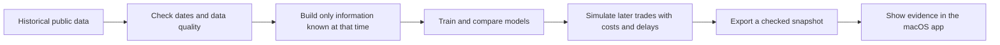
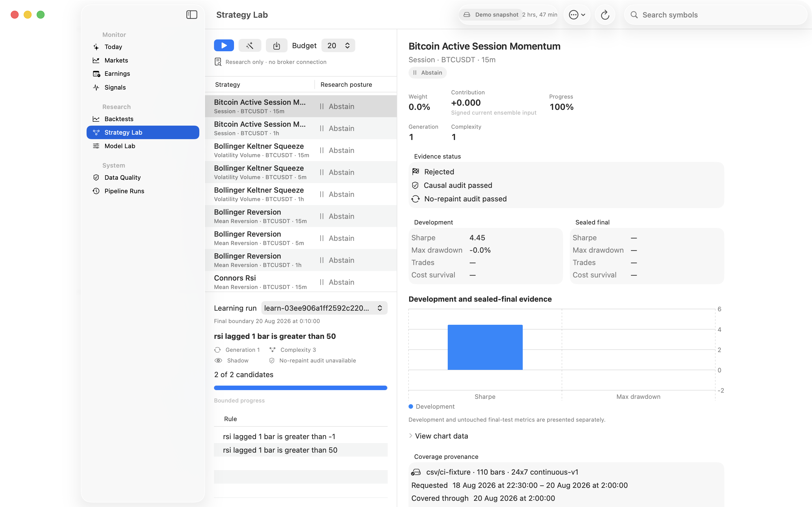

# Nowcaster for macOS

Nowcaster is a native Mac app for learning how a computer can study stocks and cryptocurrencies without pretending that it can predict the future.

It collects historical market and company information, asks models what that information might have suggested at the time, and then checks those ideas against what happened later. The app presents the result as a **research posture**—long, short, or abstain—along with the evidence, risks, and historical test results behind it.

Nowcaster is a research and risk-control tool. It can monitor **shadow** decisions and submit separately configured **Alpaca paper** orders, but real-money trading remains hard-locked unless every forward-evidence, security, signing, account, and manual-arming gate passes. It cannot guarantee profit and is not investment advice.


## What problem does it solve?

Financial markets produce far more information than a person can comfortably compare by hand. A company publishes sales figures, its share price moves, public attention changes, and the broader market may be rising or falling at the same time.

Nowcaster brings those pieces into one place and helps answer four questions:

1. What information was actually available on a given date?
2. Did a model see a positive, negative, or unclear setup?
3. Would similar historical signals have survived realistic costs and delays?
4. Is the evidence strong and stable enough to study further?

The app deliberately shows **abstain**, **research only**, or **not ready** when the evidence is weak. Doing nothing is a valid result.

## A beginner's guide to the language

| Term | Plain-English meaning |
|---|---|
| **Stock** | A small ownership share in a company. |
| **Cryptocurrency** | A digitally traded asset such as Bitcoin or Ether. It is usually more volatile than a large-company stock. |
| **Long** | A view that an asset may rise. A normal purchase is a long position. |
| **Short** | A view that an asset may fall. Real short selling involves borrowing and has special costs and risks. |
| **Signal** | A model's research output. It is a clue to investigate, not an instruction to trade. |
| **Confidence** | How complete and consistent the supporting evidence is. It is not the probability of making money. |
| **Backtest** | A historical simulation that asks how a fixed set of rules would have behaved in the past. |
| **Out of sample** | Data kept away from the model while it was being designed, then used as a more honest final exam. |
| **Sharpe ratio** | A rough comparison of return with volatility. Higher is generally better, but a good historical value can disappear in live markets. |
| **Drawdown** | The fall from a portfolio's previous high to a later low. It helps show how painful a strategy could have been. |
| **Nowcast** | An estimate of something happening now or soon, made before the final official number is known. |

## How it works



### 1. Collect historical evidence

The bundled demo uses frozen public snapshots for three companies—Starbucks (`SBUX`), McDonald's (`MCD`), and Costco (`COST`)—plus Bitcoin (`BTC-USD`) and Ether (`ETH-USD`). It also includes broad-market and sector prices for comparison.

Company filings come from SEC data. Public-attention features come from Wikimedia page views. Price snapshots are stored with checksums so the same demo can be reproduced later.

### 2. Re-create what was knowable at the time

This is one of the most important safeguards. A model studying 2022 must not accidentally see a figure published in 2023. Nowcaster records when an input became available and shifts market features so future information cannot leak backward.

### 3. Produce separate earnings and intraday-strategy research

Stocks and cryptocurrencies behave differently, so they use separate research paths:

- The stock models estimate company revenue before an earnings event and compare it with a simple historical expectation.
- The intraday library evaluates 19 configured trend, mean-reversion, volatility/volume, session, and relative-value rules at `5m`, `15m`, `1h`, or `4h` where their requirements are met.

The bundled stock expectation is a seasonal historical proxy. It is **not Wall Street consensus**.

### 4. Backtest the rules

Nowcaster walks forward through time instead of randomly mixing old and new observations. It chooses the final 20% of chronology before filtering, keeps that period out of training/calibration/weight learning, and executes a bar's signal no earlier than the next actionable bar. Intraday simulations include fees, half-spread, slippage, latency, participation limits, funding/borrow policy, exposure limits, and adverse stop-before-target ordering when both prices occur inside one bar.

The tests also look for unstable subperiods, excessive drawdowns, sensitivity to higher costs, and results that may simply be statistical luck. A backtest is still only a simulation; it cannot recreate liquidity, exchange failures, taxes, capacity, or human behaviour perfectly.

### 5. Explain the result in the Mac app

The Python engine writes one validated JSON snapshot. The SwiftUI app reads that file directly, so there is no WebView, JavaScript frontend, account server, or background website.

The app keeps the last known good snapshot if a refresh fails. Broker credentials are stored in the macOS Keychain, passed to the engine only for one process session, and never placed in command arguments, snapshots, logs, preferences, or Git.

## What you can explore in the app

- **Today** — a plain overview of the current research snapshot and its warnings.
- **Markets** — the stock and crypto instruments included in the research universe.
- **Earnings** — historical company events and revenue forecasts.
- **Signals** — long, short, and abstain postures with supporting and invalidating evidence.
- **Backtests** — returns, risk, drawdowns, costs, and development versus final-test results.
- **Strategy Lab** — compare intraday rules, run bounded learning, or start multi-generation Deep Research. It shows research evidence only and never places an order.
- **Live Monitor** — watch Alpaca stocks and Binance spot crypto through finalized bars; eligible promoted cohorts can issue hypothetical entry, SL, TP, and close notifications. It cannot place orders.
- **Model Lab** — model comparisons, calibration, and diagnostic information.
- **Data Quality** — missing, late, or invalid information that could weaken a result.
- **Pipeline Runs** — the steps used to rebuild the local research snapshot.
- **Execution Center** — broker environment, reconciliation health, paper activity, risk decisions, emergency state, and every reason real-money trading is still locked.

A sensible beginner workflow is: start on **Today**, open one signal, read its invalidation evidence, and only then look at its backtest. Avoid judging a model from its headline return alone.

### Using Live Monitor

Build and review historical evidence first, then add comma-separated watchlists in **Settings** and store Alpaca data credentials in Keychain if you monitor stocks. Open **Live Monitor**, grant notification permission, and choose **Start Monitoring**. A five-minute decision is made only after every underlying one-minute bar is finalized.

An alert contains a hypothetical entry range, stop-loss (SL), two take-profit levels (TP1/TP2), and a reason. It is allowed only when a complete promoted strategy cohort from the exact same provider/feed passes causal, no-repaint, sealed calibration/cost/uncertainty, current forward-readiness receipt, breadth, freshness, session, tradability, and risk/reward gates. The receipt is cryptographically bound to the current evidence and policy; changing either locks alerts again. The entry uses the first eligible quote after the confirming bar is final. Otherwise the result is **Abstain**. With zero qualified cohorts, monitoring can remain connected but cannot issue entries.

Disconnects clear pending decisions and reset continuity. Bounded gaps of up to 1,000 expected market minutes use exact read-only provider repair; XNYS closed hours are excluded. Incomplete or oversized gaps retain their durable watermark, retry, and stay fail-closed even if transport heartbeats resume. Repaired stop/target crossings are disclosed as delayed observations. Active hypothetical setups and tracked fills are stored independently of the rolling activity feed, recovered only for the exact unchanged provider/feed/cohort/configuration before expiry, and can produce target, stop, expiry, reversal, or close updates.

Live Monitor is notification-only: it has no order API and cannot guarantee profit. It stops while the Mac sleeps, is offline, the app is quit, or the machine is shut down. See the [beginner Live Monitor guide](docs/live-monitor.md) for setup, terminology, safety boundaries, and troubleshooting.

### Using Deep Research

Open **Strategy Lab**, select a strategy with complete data coverage, then choose **Deep Research**. The configuration sheet lets you choose:

- **Performance** to use every logical CPU, **Balanced** to leave one free, **Efficient** to use about half, or a custom worker count.
- A fixed number of candidate attempts, or continuous generations that run until you press **Stop**.
- An optional time limit and reproducible random seed.

Each generation creates typed parameter/rule challengers, evaluates them only on chronological development folds, records failures and duplicates as real trials, and stress-tests the strongest development candidate. The sealed final period is never sent to search workers. Pause drains the current small worker batch before dispatch stops; Stop checkpoints completed evidence. The app also pauses automatically under serious Mac thermal pressure.

Trying more formulas creates more chances to find a lucky historical accident. Nowcaster therefore counts every attempt and tightens its statistical interpretation using the true trial ledger, block bootstrap, Deflated Sharpe, probability of backtest overfitting, parameter stability, doubled-cost stress, drawdown, trade-count, concentration, causal, provenance, coverage, execution, sealed-holdout, and incumbent-improvement gates. A failed gate produces **No reliable strategy found** rather than hiding the failure. **Abstain** is a successful safety outcome, not an app error.

Deep Research can discover a historically stronger hypothesis; it cannot make an app fully reliable or guarantee money. Before risking capital, freeze a candidate and complete a long, untouched forward paper-trading period with measured real fills and independent review. Deep Research does not unlock live trading.



## What the bundled results currently say

These are frozen demo results through 22 August 2026. They are included to demonstrate the evaluation process, not to advertise a trading system.

| Research system | App status | Development Sharpe | Final-test Sharpe | Total trades | Worst drawdown |
|---|---|---:|---:|---:|---:|
| BTC-USD calibrated ensemble | Research only | 0.769 | 0.571 | 173 | -26.1% |
| ETH-USD calibrated ensemble | Not ready | 0.152 | 0.593 | 57 | -16.8% |

In plain language:

- Bitcoin produced an interesting historical result, but it was not profitable consistently enough across subperiods to pass the promotion rules.
- Ether's development result and sample size were too weak, even though its smaller final period was positive.
- The stock event study is also research only. Its small three-company demo did not establish a dependable edge.

No bundled strategy is considered ready for real-money decisions. The newer intraday CI fixture validates deterministic software behavior and is not market-performance evidence. Historical patterns can be overfit and can stop working.

## Install and run

### Open a built copy

Download `Nowcaster-macOS.zip` from the repository's Releases or Actions artifacts, unzip it, then Control-click `Nowcaster.app` and choose **Open** if macOS warns about an unnotarized local build.

The app requires macOS 15 or later. Locally created builds are ad-hoc signed unless Apple Developer signing credentials are supplied.

### Build it from source

You need macOS 15 or later, Xcode Command Line Tools, Python 3.11–3.13, and `uv`.

```bash
xcode-select --install
brew install uv
git clone https://github.com/james8464/nowcaster.git
cd nowcaster
make setup
make demo
make macos-app
open build/Nowcaster.app
```

The demo is deterministic and needs no API keys. `make demo` builds the local DuckDB database, runs the research stages, and exports the snapshot used by the Mac app.

## Useful developer commands

```bash
make lint                # Check Python formatting and common mistakes
make test                # Run the Python test suite
make demo                # Rebuild the bundled research demo
make research-ci         # Rebuild the network-free intraday research fixture
make research-live CACHE_DIR=/external/path # Exhaustive official Binance history
make research-live-probe CACHE_DIR=/external/path # Bounded official-provider coverage probe
make report              # Write a measured research note
make sync-macos-snapshot # Merge authoritative CI research into the app's first-launch data
make verify-swift-fixture-parity # Read-only check that the committed app fixture matches CI research
make macos-test          # Run Swift model and app tests
make macos-app           # Assemble build/Nowcaster.app
make verify-paper-trading # Broker adapter, idempotency, stream, recovery, and CLI tests
make verify-trading-readiness # Risk, emergency, forward evidence, readiness, live-lock, and arming tests
make verify-live-monitor   # Live protocol, causal alerts, native models, and deterministic replay
make replay-live-monitor   # Credential-free recorded Binance protocol replay
make verify-deep-research # End-to-end ledger, controls, resume, export, and broker-isolation tests
make macos-ui-test       # Launch the app and verify a real native window
make macos-screenshots   # Capture the primary native views
make release-archive     # Build the app ZIP and SHA-256 checksum
```

## Project layout

```text
macos/Nowcaster/    native SwiftUI app and Swift tests
src/                data ingestion, models, backtests, and snapshot export
config/             market universe, features, and model settings
data/demo/          frozen public snapshots and deterministic fixture manifests
data/research/      compact reproducible research summaries; never bulk bars
docs/               architecture, methodology, privacy, and native screenshots
tests/              Python unit, integration, leakage, and pipeline tests
scripts/            native app build and visual-verification tools
.github/workflows/  continuous integration and macOS release packaging
```

For deeper technical detail, see the [Live Monitor guide](docs/live-monitor.md), [strategy methodology](docs/strategy-methodology.md), [provider guide](docs/data-providers.md), [research results](docs/research-results.md), [architecture](docs/architecture.md), [earnings/daily methodology](docs/methodology.md), [backtest protocol](docs/backtest_protocol.md), [data dictionary](docs/data_dictionary.md), [macOS guide](docs/macos_app.md), [privacy policy](docs/privacy.md), and [verification record](docs/native_verification.md).

## Data, privacy, and limitations

- The bundled demo is historical and is not a real-time market feed.
- Public data can be missing, revised, delayed, or wrong.
- Yahoo chart data comes from an unofficial endpoint with no service guarantee.
- Users are responsible for data-provider terms and production data licences.
- `BTC-USD` and `ETH-USD` map to Binance `BTCUSDT` and `ETHUSDT` for provider research. These are venue-specific USDT spot pairs, not composite USD prices.
- Raw credentials and bulk/licensed bars stay outside Git. Only fixture descriptors, checksummed manifests, and compact results are committed.
- Optional Alpaca paper trading contacts Alpaca only after the user stores separate paper credentials in Keychain. Live credentials use a different Keychain service and endpoint and cannot fall back to paper credentials.
- Broker orders, positions, reconciliation results, and risk decisions remain local in DuckDB and a bounded snapshot; full account IDs and raw secret-bearing payloads are excluded.
- Short selling, leverage, crypto trading, and derivatives can lose more money or move faster than a beginner expects.

This standalone project was originally developed inside a downloaded GS Quant source tree and can optionally cross-check a small return calculation with the open-source `gs_quant` package. The trading control plane is a separate Nowcaster implementation. Nowcaster is not affiliated with or endorsed by Goldman Sachs or Alpaca.
