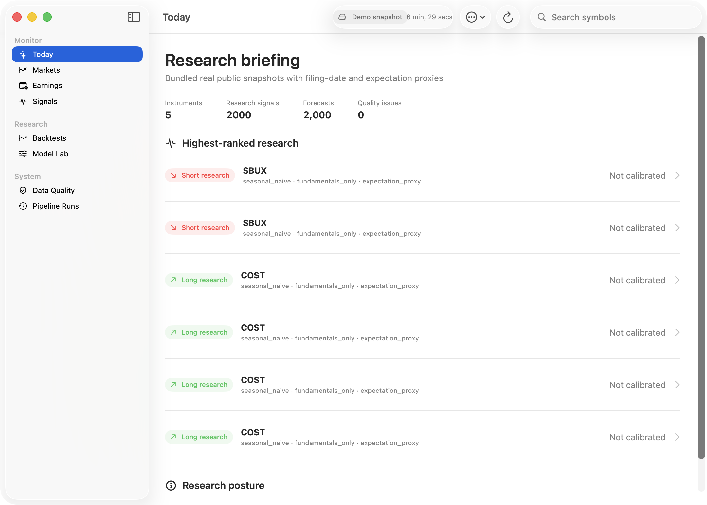
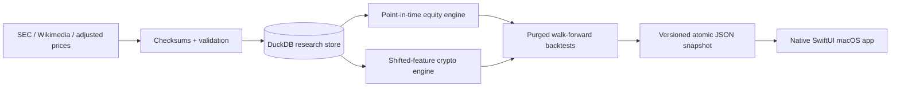

# Nowcaster for macOS

Nowcaster is a native SwiftUI research workstation for monitoring equities and crypto, reviewing evidence-ranked long/short research postures, and auditing leakage-resistant backtests. It is a decision-support application—not an order router, signal-selling service, or promise of profit.

The app is built with SwiftUI, Swift Charts, and native macOS navigation. It contains no browser shell, WebView, JavaScript frontend, account login, or brokerage integration. A local Python research engine produces a versioned JSON snapshot that the app reads without running a server.



## What it does

- Monitors SBUX, MCD, COST, BTC-USD, and ETH-USD from bundled, checksum-verified public snapshots.
- Shows research postures only when declared evidence gates clear; otherwise it abstains.
- Keeps confidence, calibrated direction, catalyst, invalidation, and eligibility separate.
- Forecasts equity revenue from point-in-time fundamentals and public attention data.
- Researches crypto direction in a separate, shifted-feature ensemble—never by applying an earnings model to crypto.
- Exposes development and final-test results, costs, lag, drawdown, stability, sensitivity, and data quality.
- Rebuilds local research through a shell-free `Process` runner and preserves the last-known-good snapshot on failure.

## Measured bundled results

These are frozen demo measurements through 22 August 2026, not selected live claims.

| Research system | Status | Development Sharpe | Final-test Sharpe | Full Sharpe | Trades | Full max drawdown |
|---|---|---:|---:|---:|---:|---:|
| BTC-USD calibrated ensemble | Research only | 0.769 | 0.571 | 0.691 | 173 | -26.1% |
| ETH-USD calibrated ensemble | Not ready | 0.152 | 0.593 | 0.258 | 57 | -16.8% |

BTC remains research-only because fewer than 75% of subperiods were profitable. ETH fails the declared promotion gates, including sample size and development performance. The equity event study is also research-only: the bundled three-company universe uses a seasonal expectation proxy—not Wall Street consensus—and its [0,+3] abnormal-return top-minus-bottom spread is about -0.04%.

Historical performance can be overfit and may not persist. Confidence is evidence quality, not a probability of profit. This software is educational research and not investment advice.

## Build and run

Requirements: macOS 15 or later, Xcode Command Line Tools, and Python 3.11–3.13. The bundled demo needs no API keys.

```bash
xcode-select --install
brew install uv
git clone https://github.com/james8464/nowcaster.git
cd nowcaster
make setup
make demo
make macos-app
open build/Nowcaster.app
```

`build/Nowcaster.app` is ad-hoc signed for local use. macOS may require Control-click → Open for an unsigned download. Release workflows support optional Developer ID signing and notarization when repository secrets are configured.

## Verification commands

```bash
make lint               # Ruff formatting and static analysis
make test               # Python suite
make demo               # deterministic engine run and native snapshot export
make sync-macos-snapshot # refresh the checked-in first-launch snapshot
make macos-test         # Swift model, decoding, security, and accessibility tests
make macos-ui-test      # launch the signed app and verify a real window
make macos-screenshots  # all primary screens, light/dark, plus narrow layouts
make release-archive    # app ZIP and SHA-256 checksum
```

The legacy Streamlit dashboard remains only as a deprecated research-migration aid via `make dashboard`; it is not the product runtime.

## Architecture



The two runtimes share a strict snapshot contract. No HTTP service is required. See [architecture](docs/architecture.md), [methodology](docs/methodology.md), [backtest protocol](docs/backtest_protocol.md), [macOS guide](docs/macos_app.md), [privacy](docs/privacy.md), and [data dictionary](docs/data_dictionary.md).

## Data and research caveats

| Source | Use | Point-in-time treatment | Limitation |
|---|---|---|---|
| SEC EDGAR Company Facts | Reported equity fundamentals | Filing date is availability date | Filing date proxies event timing |
| Wikimedia Analytics | Public-attention features | Explicit publication lag | Noisy and non-causal |
| Yahoo chart endpoint snapshots | Adjusted equity/crypto prices | Frozen files, dates, and SHA-256 | Unofficial endpoint; no SLA |
| User CSV / optional API | Historical expectations | Latest revision at or before cutoff | Bundled demo has no real consensus |

Users are responsible for provider terms and production data licensing. The application stores no brokerage credentials and never places orders.

## Project map

```text
macos/Nowcaster/    native SwiftUI application and tests
src/                ingestion, features, modelling, backtests, snapshot export
config/             typed research and universe configuration
data/demo/          frozen real public source snapshots and manifests
data/app/           generated native application snapshot
docs/               architecture, methodology, operations, privacy, screenshots
tests/              unit, integration, leakage, CLI, and documentation tests
.github/workflows/  macOS CI and checksumed release packaging
dashboard/          deprecated Streamlit research fallback
```

This standalone project was originally developed inside a downloaded GS Quant source tree. It can optionally cross-check returns with `gs_quant`, but it is not affiliated with or endorsed by Goldman Sachs.
