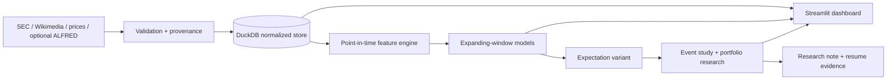
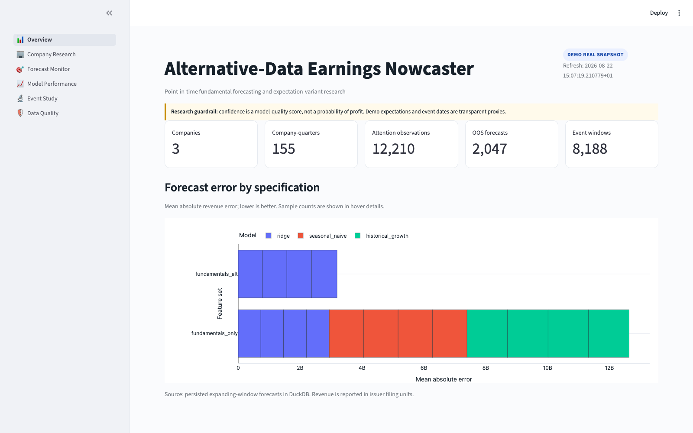
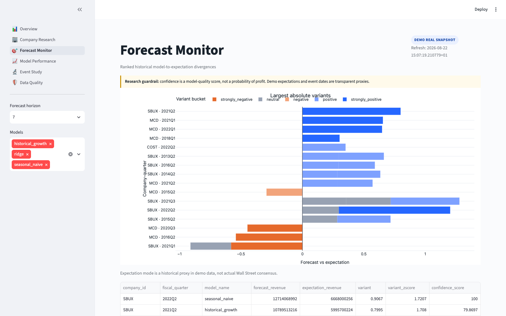
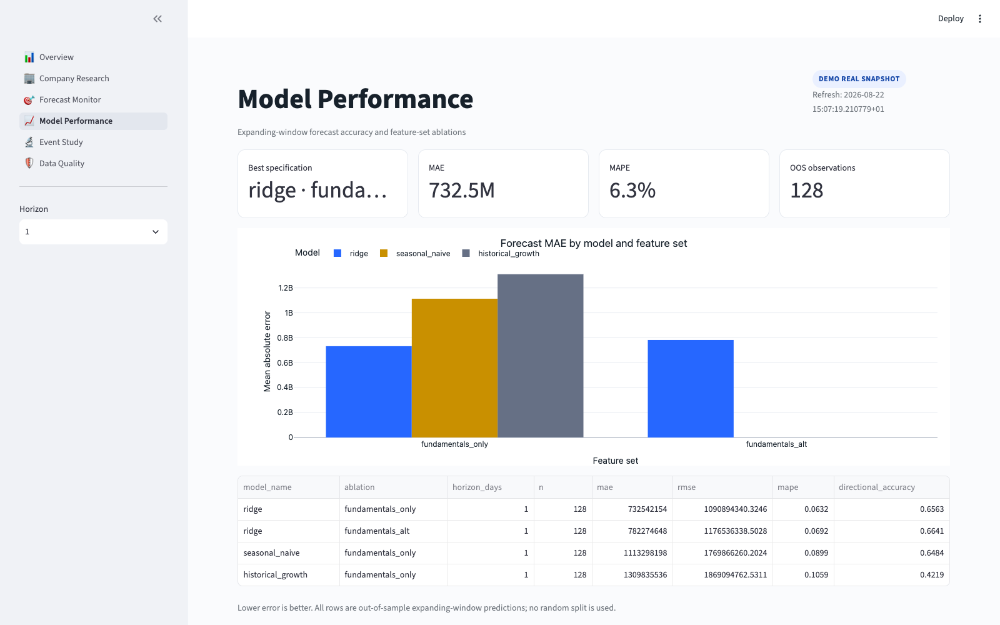
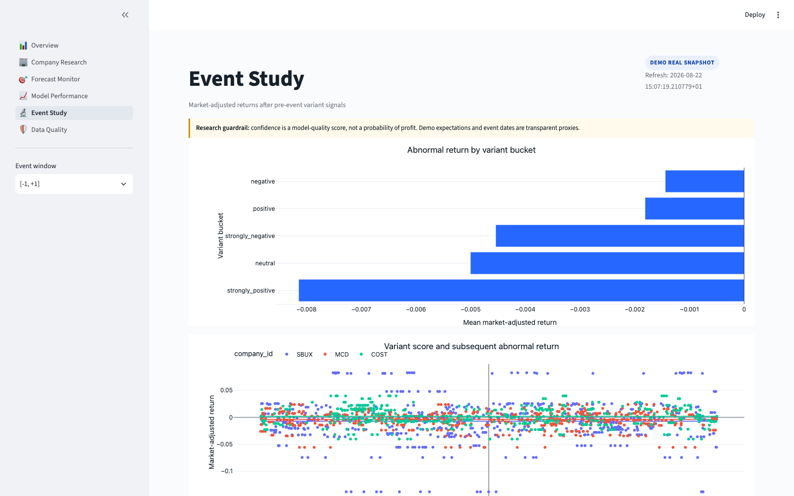

# Alternative-Data Earnings Nowcaster

Can publicly observable alternative data identify earnings expectations that are too high or too low before a company reports?

This is a point-in-time investment-research platform, not a signal-selling app. It ingests SEC fundamentals, Wikimedia attention, adjusted prices, and optional vintage-safe macro data; constructs leakage-audited pre-event features; produces expanding-window revenue forecasts; compares them with a user-supplied expectation or a clearly labelled proxy; and evaluates subsequent event returns.

The repository is a standalone project inside a downloaded GS Quant source tree. It uses the local `gs_quant` package only for an optional return-calculation cross-check. This project is not affiliated with or endorsed by Goldman Sachs.

## Measured demo results

The bundled demo uses real public snapshots for SBUX, MCD, and COST—never synthetic “live” results.

| Measure | Verified demo value |
|---|---:|
| SEC company-quarters | 155 |
| Daily Wikimedia observations | 12,210 |
| Adjusted-price observations | 26,616 |
| Expanding-window forecasts | 2,047 |
| Event signal-window observations | 8,188 |
| Fundamentals-plus-attention Ridge MAE vs seasonal baseline | 28.3% lower |
| Incremental attention-data MAE vs fundamentals-only Ridge | 8.4% worse |
| [0,+3] top-minus-bottom abnormal-return spread | -0.04% |

The central finding is deliberately unvarnished: the full model beat a naive seasonal baseline, but the attention features did not add value relative to the matched fundamentals-only model. The small event spread is not evidence of a profitable strategy.

## Investment thesis

The research question has three separate links:

1. Can public attention improve a forecast of the next reported fundamental?
2. Does the forecast differ from the expectation observable before the event?
3. Is that divergence associated with post-event returns after market and sector adjustment?

The platform never treats these as interchangeable. Demo mode uses a prior-year seasonal expectation proxy, which is not Wall Street consensus. Event dates are SEC filing-date proxies. Confidence is a research-quality score, not a probability of profit.

## Architecture



The CLI is restartable: each stage records its configuration hash, Git revision, timestamps, status, and row counts. Derived rows retain their source, source version, and creation time. See [architecture](docs/architecture.md), [methodology](docs/methodology.md), and [data dictionary](docs/data_dictionary.md).

## Dashboard

| Overview | Forecast monitor |
|---|---|
|  |  |

| Model performance | Event study |
|---|---|
|  |  |

Additional pages cover [company research](docs/images/company_research.png) and [data quality](docs/images/data_quality.png).

## Data sources

| Source | Use | Point-in-time treatment | Important limitation |
|---|---|---|---|
| SEC EDGAR Company Facts | Quarterly revenue and reported metrics | Filing date is `available_date` | XBRL tag transitions and filing-date event proxy |
| Wikimedia Analytics | Daily company-page attention | One-day publication lag | Attention is noisy and begins July 2015 |
| Yahoo chart endpoint | Adjusted company, SPY, and sector-ETF closes | Daily price dates | Unofficial endpoint; no SLA or institutional license |
| FRED/ALFRED | Optional macro context | Only vintage-specific observations accepted | Bundled latest-revised CSVs are excluded from historical modelling |
| User CSV / optional API | Historical consensus | Latest revision at or before cutoff | Demo has no real historical consensus |

Snapshot manifests record retrieval URLs, timestamps, source notes, and SHA-256 hashes. Users remain responsible for provider terms and any production-market-data license.

## Forecasting and backtesting

- Forecast cutoffs: configurable; the demo evaluates 1, 7, 14, and 30 calendar days before the event proxy.
- Feature rule: `maximum_input_available_date <= forecast_cutoff_date` for every row.
- Validation: separate expanding windows by horizon; a label becomes trainable only after its reported-result date, and all preprocessing is fit inside each fold.
- Models: seasonal naive, historical growth, OLS/Ridge/Elastic Net, and histogram gradient boosting.
- Ablations: fundamentals only, alternative only, fundamentals + alternative, and optional vintage-safe macro.
- Variant: `(model forecast - expectation) / expectation`, plus within-cohort z-scores and five buckets.
- Event windows: `[-1,+1]`, `[0,+1]`, `[0,+3]`, and `[0,+5]`, with identical-date market and sector adjustment.
- Robustness: bootstrap intervals, hit rates, t-statistics, Newey-West regression, overlap disclosure, and transaction-cost-aware long/short research simulation.

The exact definitions and failure modes are in [methodology.md](docs/methodology.md).

## macOS setup

Supported: Apple Silicon and Intel Macs with Python 3.11–3.13.

```bash
xcode-select --install
brew install uv
git clone <repository-url>
cd alternative-data-earnings-nowcaster
make setup
cp .env.example .env
make demo
make test
make dashboard
```

Open `http://localhost:8501`. Demo mode needs no API keys. The optional live path requires an identifying `SEC_USER_AGENT` containing contact information; optional vintage macro ingestion also requires `FRED_API_KEY`.

If `uv` is unavailable, create a virtual environment with Python 3.11–3.13 and run `pip install -e '.[dev]'`.

## Commands

```bash
make demo          # build the real-snapshot database and reports without API keys
make test          # run the complete automated suite
make lint          # Ruff formatting and static checks
make fetch         # load bundled demo source snapshots stage by stage
make features      # build point-in-time quarterly features
make train         # generate expanding-window forecasts
make backtest      # construct variants and event returns
make dashboard     # launch the six-page Streamlit app
make report        # regenerate evidence-backed Markdown outputs
```

Equivalent commands are available through `python -m src.cli --help`. Live execution is opt-in with `--mode live`; it never silently substitutes demo data.

## Project map

```text
src/            ingestion, validation, feature, model, consensus, backtest, reporting
dashboard/      six-page Streamlit research UI
config/         typed universe, feature, model, and backtest configuration
data/demo/      bundled real public snapshots and manifests
notebooks/      thin reproducible exploration clients; no pipeline logic
reports/        generated research note and measured resume bullets
docs/           architecture, methodology, dictionary, interview guide, images
tests/          unit, integration, leakage, CLI, notebook, and dashboard tests
```

## Interview guide and limitations

Use [interview_guide.md](docs/interview_guide.md) for a concise walkthrough of decisions, strongest and weakest results, and sensible institutional extensions. Generated claims live in `reports/latest_research_report.md` and `reports/resume_bullets.md`; they are deliberately ignored by Git because they must be regenerated from the current database.

This project is educational research and not investment advice. It does not place orders, promise “high-confidence” profits, model intraday execution, or establish that public alternative data creates durable alpha. Historical performance can be overfit and may not persist.
