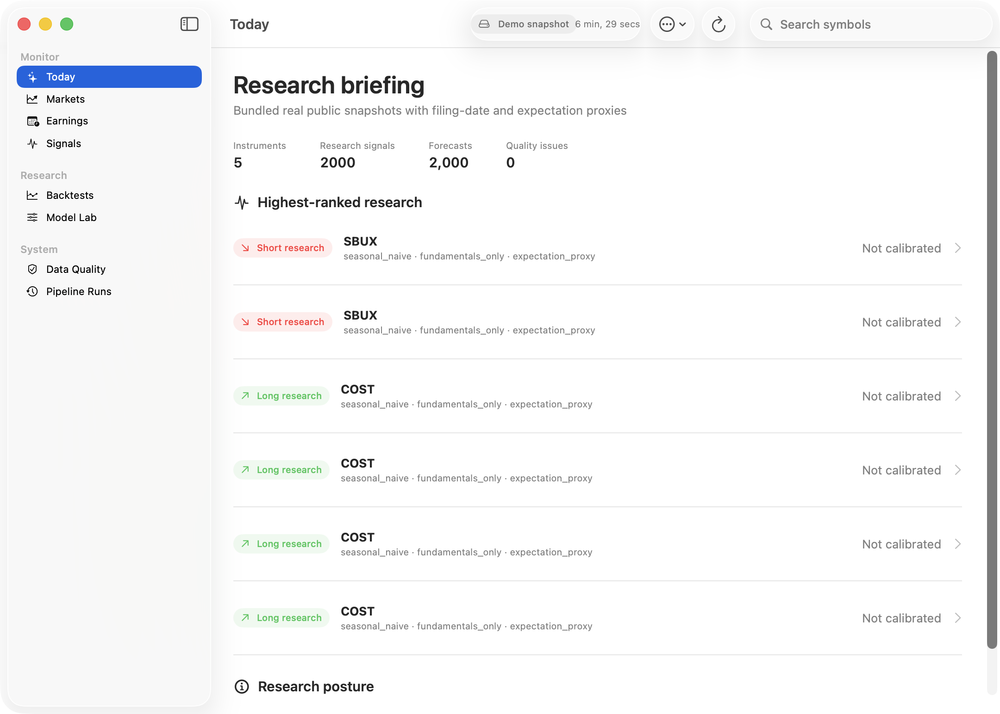
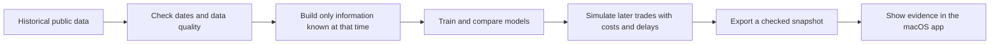
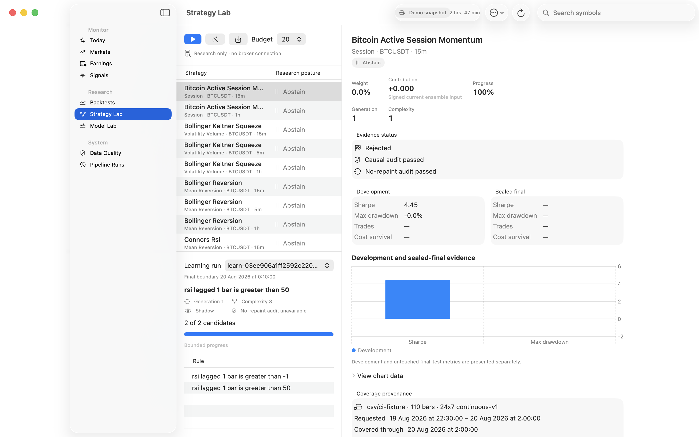

# Nowcaster for macOS

## Intraday rebuild: experimental paper research

Nowcaster now has a separate, **paper-only** intraday research track for
Germany 40 and US 500 index CFDs, EUR/USD, and conditionally West Texas oil.
It studies three understandable ideas: an opening-range breakout, a pullback
within a trend, and a return toward the middle of a range. Each idea can say
**no trade**. A possible trade includes its direction, entry condition, stop,
target and time exit; later account quotes determine a hypothetical result.
This does not place a broker order or establish that the strategy makes money.

The new panel in **Trade Desk** shows feed health, a paper opportunity or a
reason to stand aside, open paper positions and the evidence status. It does
not turn a diagnostic opportunity into a qualified alert. The existing BTC/ETH
study and its results remain separate and unchanged.

To evaluate a broker product, create your own OANDA **practice** account and
put its account ID and token in the `OANDA_PRACTICE_ACCOUNT_ID` and
`OANDA_PRACTICE_TOKEN` environment variables. The research command
`scripts/run_intraday_research.py` can list the demo account's products
(`inventory`), check an exact product (`discover`), save exploratory historical
bid/ask bars (`fetch`), and follow one specified UTC paper session (`run`).
The `run` command also needs a cost file with a source and explicit user-attested
spread/slippage, commission and financing assumptions. It never accepts a
credential as an argument and has no order-submission operation. The optional
[Pine visual companion](docs/pine/nowcaster-intraday-companion.pine) shows
approximate confirmed-bar setups on a chart; chart prices are **not** the
account-specific bid/ask prices used for paper fills.

This track is **not yet ready to copy with real money**: a practice account and
its exact available instruments have been checked, but product terms, actual
costs and sustained forward quotes have not been verified in this checkout.
Broker inventory alone cannot enable a paper entry: exact product identity,
source-backed costs and margin, open trading hours, and a fresh GBP conversion
must all agree. The demo account labels `DE30_EUR` “Germany 30”; Nowcaster
retains that label rather than treating it as a different Germany 40 contract.
Historical strategy selection now keeps every tested rule/direction and its
zero-trade or loss result. It separates development, validation and sealed
chronology, stresses execution costs and requires positive net evidence before
returning a candidate; these historical candles remain exploratory, not
account-specific live fills.
The stressed screen now raises slippage, commission and financing together.
A wholly missing declared weekday between observed sessions blocks selection;
without a verified holiday calendar, it is treated conservatively as a data
gap. Selection inputs must declare a download window covering the sealed
period, so a truncated download cannot masquerade as a complete test.
By default, each historical stage needs at least 30 observed sessions and 30
closed hypothetical trades. A lucky three-day result cannot pass that default
gate. The pre-registered manifest can set a different minimum; no historical
sample check proves that a rule works live.
The separate `scripts/run_intraday_selection.py` command accepts a frozen
`SelectionManifest` JSON file, one downloaded historical bid/ask JSONL file
per exact product (`--input DE30_EUR=path.jsonl`), and a new
`--output-directory`. It creates an immutable copy of the inputs and a
`selection.json` containing every attempt, including losses and rejections.
It refuses to overwrite an earlier round and does not activate a live rule.
The new multi-product practice-stream core records sanitized quotes and
decisions in a separate append-only journal. A restart, stale quote or broken
five-minute bar forces a fresh warm-up instead of filling an imagined trade.
It also retains `capture_quality.json` for each monitored day and the latest
day in `IntradayResearch`. The Trade Desk's Market checks show how many
declared five-minute intervals contained an observed tradeable account quote,
plus median and high-end spreads. These are feed observations, not proof that
an order could have filled or permission to paper-trade. The declared session
window is still provisional until exact broker hours are verified.
At this stage its setups are diagnostic until the paper portfolio is wired
into the Mac service.
The separate paper-portfolio core can size a hypothetical position across
products using one GBP equity balance. A ticket records the actual bid/ask
side, units, stop, target, time exit, notional, effective leverage, broker
margin estimate, cost source and estimated costs. It respects a 0.25% risk
budget per trade, 1% daily realized-loss stop, 5% drawdown halt and 1.0×
aggregate notional cap. A missing quote or conversion leaves a paper position
unresolved instead of inventing a profitable exit.
The Mac Trade Desk has an opt-in **Start Monitoring** control for an OANDA
practice-only helper. It retrieves the saved practice token from Keychain,
passes it only to that helper's environment, and keeps monitoring when the
window closes. Its initial live mode is diagnostic: it confirms exact demo
products and watches account quotes, but does not auto-authorize a paper
entry from an unverified cost schedule or an unselected rule. It never sends
broker orders. **Pause Monitoring** requests a clean stop; quitting the app
stops this diagnostic helper.
The Trade Desk refreshes product quote ages and shows a compact paper-results
summary. Expand **Costs and evidence** for gross/net results, modeled charges,
sample limits and coverage; an open paper ticket, if one exists in an
authorized future round, lists its direction, units, entry, stop, target,
time exit, effective leverage, margin estimate and cost source. **Paper
alerts** are off by default; diagnostic setups never trigger them.
The paper-results report is reconstructed across all retained daily quote and
paper journals, including after restarting the app. It keeps earlier losses,
abstentions and unresolved positions instead of resetting at midnight. A
confirmed diagnostic setup that cannot become a paper trade is recorded with
the missing-selection-and-cost reason even if the app stops immediately after
the setup. Completed days are cached after validation; the current day's
report is rebuilt off the quote-processing path so reporting cannot hold up
incoming prices. Results from a different practice account cannot be mixed
into the same report. The report reconciles gross
P&L with commissions and financing, and reports net expectancy, win rate,
drawdown and a daily-block uncertainty bound only when the sample supports
one. A high win rate can still have negative net P&L. The initial diagnostic
run has no authorized paper entries, so its report correctly starts empty.
The app helper reconnects and retains multiple days while the app and Mac remain
running; it does not collect while the Mac is asleep or offline. [OANDA's account stream](https://developer.oanda.com/rest-live-v20/pricing-ep/)
samples prices rather than sending every price change, and its
[historical prices can differ from account pricing](https://help.oanda.com/us/en/faqs/rest-v20-api-troubleshooting-guide.htm?Highlight=api).
The release gate remains at least 90 calendar
days and 100 closed prospective paper trades, reliable session coverage, and
positive net results even under the predeclared uncertainty and cost checks.
None of those conditions is currently met. No paid data feed is assumed.

**Latest measured strategy check (4 October 2026):** A fixed six-candidate
BTC/ETH trend comparison completed. All six lost after modeled costs in both
date windows; none advances to a new paper study. This separate 15-minute
experiment does not change the installed app or the retained live studies.
[Read the trades, costs, data limits and decision](docs/research/trend-check-2026-10-04.md).

Nowcaster is a native Mac app for learning how a computer can study stocks and cryptocurrencies without pretending that it can predict the future.

It collects historical market and company information, asks models what that information might have suggested at the time, and then checks those ideas against what happened later. The app presents the result as a **research posture**—long, short, or abstain—along with the evidence, risks, and historical test results behind it.

Nowcaster is a research and risk-control tool. It can monitor **shadow** decisions and submit separately configured **Alpaca paper** orders, but real-money trading remains hard-locked unless every forward-evidence, security, signing, account, and manual-arming gate passes. It cannot guarantee profit and is not investment advice.

**Paper desk:** Trade Desk opens with Bitcoin and Ether, one **Start/Pause**
control, and dated reasons to stand aside. **History** keeps earlier outcomes;
**Research** explains optional background learning and its resource limits.
A started session continues when you close the window. **Quit** stops its
collector and research workers. It uses public data without an account and
never places trades. Paper results are not proof of profitability.
[Read the beginner-friendly guide](#use-the-trade-desk).

**Day-trader decision context:** Trade Desk explains whether the 1-, 5- and
15-minute trends agree, how volatile the market is, whether quotes are usable,
and whether a scheduled event calls for standing aside. Completed hypothetical
outcomes have their own historical section. A target being touched is an observed
paper outcome, not proof that a trade was filled or money was made. Missing
calendar or quote timing evidence blocks fresh research suggestions. Public
Binance ticker events supply timestamped best bid/ask prices and displayed sizes;
stale, future-dated or malformed events cannot clear that gate.

**Diagnostic simulator (source build):** Choose a registered paper source and
select **Enable Diagnostic Simulator** in Trade Desk, then **Start** the paper
session. The separate opt-in ledger starts with 10,000 simulated USDT and tracks
observed breakout/pullback hypotheses, later hypothetical fills, paid exits,
cash, marked equity and completed net outcomes. It shows losses as well as wins;
open positions are excluded from completed outcomes. Stale quotes and valuation
times remain visible. Setup evidence and post-trade review expand on demand.
This does not qualify an alert, request notification permission or place orders.
Public spot BTC/ETH supports long/flat only; missing imported calendar coverage
blocks entry and no news interpretation is invented. A closed window keeps the
started session running; Quit, sleep or an unavailable feed stops progress. No
daemon or app installation is added. [Policy and evidence details](docs/research/live-paper-signals.md#diagnostic-simulator).

**Cost-aware advisor (new research policy, not yet installed):** A rising trend
is not enough. The source-code advisor now estimates what would remain at the
target, and what would be lost at the stop, after charging both entry and exit
fees, slippage and spread at twice the declared assumptions. It stands aside
if the target would not cover those costs or the net reward is smaller than
the net risk. The latter is a fixed, conservative research choice—not a claim
that 1:1 is optimal or that lower-ratio strategies cannot be profitable.

This is a scenario calculation, not a prediction. For example, a target 1.5%
above entry and a stop 1% below entry look like 1.5:1 before costs. With the
paper desk's 10-basis-point fee and 5-basis-point slippage **per side**, doubled
for stress, the sampled BTC/ETH quotes on 3 October yielded about 0.56:1 net.
A stop-or-target-only model would need roughly 64% target hits just to break
even. That is a **required** success rate, not an estimated success rate. Time
exits, gaps and changing spreads make the real outcome different.

The policy is named `trend-advisor-v2-cost-screen` and hashed into new advisor
evidence. Old reports cannot silently switch to it: the existing manifest
guard requires a separate round. No existing targets, fees, learning budgets,
results or running session were changed to make a candidate pass. This
source-only change does not replace the installed app or establish an edge;
a separately recorded evaluation and deployment are still required. The
earlier [140-hypothesis audit](docs/day-trading-opportunity-audit-2026-09-01.md)
selected no strategy. Adding this filter does not turn those failures into wins.
The model uses declared research costs, not account-specific fees or discounts;
[Binance documents how actual spot commissions depend on the trade and account](https://github.com/binance/binance-spot-api-docs/blob/master/faqs/commission_faq.md).

Source verification on 3 October 2026: 1,787 Python tests passed in 946 seconds;
seven packaged-helper checks were explicitly skipped, not counted as passes.
The preceding engine build was temporarily retained outside the build path and
restored afterward; it was not represented as a build of this new policy.
Fifteen native snapshot tests, formatting/lint, secret scanning and scoped review
also passed. Generated fixture changes were verified to be provenance hashes
only. These are software checks, not a strategy backtest or evidence of profit.

For a qualified intraday alert, the required probability means “the target is reached before the protective stop within the declared horizon, after the entry decision.” A research model that only measures positive strategy returns cannot supply that probability: it remains research-only. Neither kind of estimate is a promise that a whole account will make money.



## What problem does it solve?

Financial markets produce far more information than a person can comfortably compare by hand. A company publishes sales figures, its share price moves, public attention changes, and the broader market may be rising or falling at the same time.

Nowcaster brings those pieces into one place and helps answer four questions:

1. What information was actually available on a given date?
2. Did a model see a positive, negative, or unclear setup?
3. Would similar historical signals have survived realistic costs and delays?
4. Is the evidence strong and stable enough to study further?

The app deliberately shows **abstain**, **research only**, or **not ready** when the evidence is weak. Doing nothing is a valid result.

## A beginner's guide to the language

| Term | Plain-English meaning |
|---|---|
| **Stock** | A small ownership share in a company. |
| **Cryptocurrency** | A digitally traded asset such as Bitcoin or Ether. It is usually more volatile than a large-company stock. |
| **Long** | A view that an asset may rise. A normal purchase is a long position. |
| **Short** | A view that an asset may fall. Real short selling involves borrowing and has special costs and risks. |
| **Signal** | A model's research output. It is a clue to investigate, not an instruction to trade. |
| **Confidence** | How complete and consistent the supporting evidence is. It is not the probability of making money. |
| **Backtest** | A historical simulation that asks how a fixed set of rules would have behaved in the past. |
| **Out of sample** | Data kept away from the model while it was being designed, then used as a more honest final exam. |
| **Sharpe ratio** | A rough comparison of return with volatility. Higher is generally better, but a good historical value can disappear in live markets. |
| **Drawdown** | The fall from a portfolio's previous high to a later low. It helps show how painful a strategy could have been. |
| **Nowcast** | An estimate of something happening now or soon, made before the final official number is known. |

## How it works


```mermaid
flowchart LR
    A[Historical public data] --> B[Check dates and data quality]
    B --> C[Build only information known at that time]
    C --> D[Train and compare models]
    D --> E[Simulate later trades with costs and delays]
    E --> F[Export a checked snapshot]
    F --> G[Show evidence in the macOS app]
```

### 1. Collect historical evidence

The bundled demo uses frozen public snapshots for three companies—Starbucks (`SBUX`), McDonald's (`MCD`), and Costco (`COST`)—plus Bitcoin (`BTC-USD`) and Ether (`ETH-USD`). It also includes broad-market and sector prices for comparison.

Company filings come from SEC data. Public-attention features come from Wikimedia page views. Price snapshots are stored with checksums so the same demo can be reproduced later.

### 2. Re-create what was knowable at the time

This is one of the most important safeguards. A model studying 2022 must not accidentally see a figure published in 2023. Nowcaster records when an input became available and shifts market features so future information cannot leak backward.

### 3. Produce separate earnings and intraday-strategy research

Stocks and cryptocurrencies behave differently, so they use separate research paths:

- The stock models estimate company revenue before an earnings event and compare it with a simple historical expectation.
- The intraday library evaluates 19 configured trend, mean-reversion, volatility/volume, session, and relative-value rules at `5m`, `15m`, `1h`, or `4h` where their requirements are met.

The bundled stock expectation is a seasonal historical proxy. It is **not Wall Street consensus**.

### 4. Backtest the rules

Nowcaster walks forward through time instead of randomly mixing old and new observations. It chooses the final 20% of chronology before filtering, keeps that period out of training/calibration/weight learning, and executes a bar's signal no earlier than the next actionable bar. Intraday simulations include fees, half-spread, slippage, latency, participation limits, funding/borrow policy, exposure limits, and adverse stop-before-target ordering when both prices occur inside one bar.

The tests also look for unstable subperiods, excessive drawdowns, sensitivity to higher costs, and results that may simply be statistical luck. A backtest is still only a simulation; it cannot recreate liquidity, exchange failures, taxes, capacity, or human behaviour perfectly.

### 5. Explain the result in the Mac app

The Python engine writes one validated JSON snapshot. The SwiftUI app reads that file directly, so there is no WebView, JavaScript frontend, account server, or background website.

The app keeps the last known good snapshot if a refresh fails. Broker credentials are stored in the macOS Keychain, passed to the engine only for one process session, and never placed in command arguments, snapshots, logs, preferences, or Git.

### How to read an accuracy card

- **Calibrated probability** must name the outcome being measured. Strategy-return calibration now fits on earlier data, chooses its threshold on a separate middle block, and checks it on a later confirmation block. If there is too little usable evidence, it is unavailable.
- **Probability range** describes uncertainty in the stated evidence, not a guaranteed interval for the next trade. A narrow-looking range can still be wrong after a market change.
- **Brier score** and calibration error measure whether historical probabilities matched observed frequencies.
- **Lower net edge** is the conservative return estimate after modeled fees, spread, slippage, execution uncertainty, and statistical uncertainty. A non-positive value forces Abstain.
- **Coverage** is the fraction of otherwise eligible observations on which the selective model was willing to speak. Higher confidence often means lower coverage.
- **Drift** warns when features, predictions, calibration errors, costs, latency, or realized edge stop resembling the sealed evidence.

Missing evidence is displayed as unavailable; the app does not silently substitute a favorable number.

Qualified cohort loading now requires a [versioned calibration evidence contract](docs/calibration-evidence-contract.md). Legacy receipts without that contract no longer qualify, even if their hashes and old readiness evidence still match. Their database rows remain unchanged for research. The current strategy-return calibration producer remains research-only; there is no production target-before-stop event-calibration producer.

### Why different assets get different strategies

The **Assess Markets** button in Strategy Lab runs an extra asset-selection and strategy-weighting assessment. Think of it as choosing both the playing field and the tools:

1. **Choose usable markets.** Check history, freshness, trading hours, volume, spread and available order-book depth. The bundled intraday universe is deliberately just Bitcoin and Ether on Binance spot. Adding a symbol does not automatically make it suitable. Spot shorts are not supported.
2. **Describe current conditions.** A market can be trending calmly, trending with high volatility, moving sideways with good liquidity, or stressed. The app shows a mixture of these possibilities, not a claim to know the future.
3. **Compare the right past evidence.** Each strategy is evaluated by asset, direction and conditions. When local evidence is thin, it borrows cautiously from the broader asset profile instead of trusting a handful of lucky trades.
4. **Avoid counting the same idea twice.** Similar indicators and highly correlated assets do not provide independent confirmation. The allocation penalizes duplication, limits concentration and can leave everything in cash.
5. **Explain the decision.** Markets and signal details show eligibility, market conditions, local versus broader evidence, portfolio conflicts and a research-only size ceiling. That ceiling is not an order or a personal position-size recommendation.

The **Learn Weights** button compares a bounded, recorded set of contextual policies on chronological development data. All assets share one simulated account and timeline; adding a duplicate asset cannot manufacture extra history. A different holding period is tested only when actual execution outcomes for that period exist—the bundled contextual path supplies one-bar outcomes. It never invents a longer trade by adding unrelated returns together.

A winning experiment remains a **shadow hypothesis**. It does not change a live strategy's calibrated voting weights, override readiness checks, or place an order. **Deep Research** remains the separate resource-controlled, multi-generation strategy search.

Backtests use only the data actually ingested and verified. Historical candles do not reconstruct missing historical order books, borrow availability or exchange outages. The contextual portfolio replay stays in cash when tradability cannot be established, rejects incomplete selected execution records, and labels its holdout as retrospective—not independent proof of profitability. No bundled result establishes a dependable day-trading income.

## What you can explore in the app

The four everyday destinations are **Trade Desk**, **Markets**, **History** and
**Research**. Start with Trade Desk, select an asset to read its current evidence,
then use History for dated hypothetical outcomes. Research distinguishes
collecting observations, training, Waiting, paused and blocked work.

Expand **Advanced** for the existing specialist tools:

- **Today** — a plain overview of the current research snapshot and its warnings.
- **Earnings** — historical company events and revenue forecasts.
- **Signals** — long, short, and abstain postures with supporting and invalidating evidence.
- **Backtests** — returns, risk, drawdowns, costs, and development versus final-test results.
- **Strategy Lab** — compare intraday rules, run bounded learning, or start multi-generation Deep Research. It shows research evidence only and never places an order.
- **Candidate markets** — Strategy Lab labels new markets such as WTI crude oil as **Research only** until a named, verified intraday contract dataset passes intake. An unavailable or rejected market cannot produce a signal, notification, or order.
- **Live Monitor** — watch Alpaca stocks and Binance spot crypto through finalized bars; eligible promoted cohorts can issue hypothetical entry, SL, TP, and close notifications. It cannot place orders.
- **Experimental opportunities** — a separate, view-only part of Live Monitor for fresh directional research that has not passed promotion. It can show deterministic paper-only reference levels, but it is unqualified and cannot create a setup, lifecycle record, notification, or order.
- **Model Lab** — model comparisons, calibration, and diagnostic information.
- **Data Quality** — missing, late, or invalid information that could weaken a result.
- **Pipeline Runs** — the steps used to rebuild the local research snapshot.
- **Execution Center** — broker environment, reconciliation health, paper activity, risk decisions, emergency state, and every reason real-money trading is still locked.

Avoid judging a model from its headline return alone. Legacy Live Monitor and
Execution Center have separate provider and account requirements; starting the
paper desk does not start them or read broker credentials.

### Using Live Monitor

Build and review historical evidence first, then add comma-separated watchlists in **Settings** and store Alpaca data credentials in Keychain if you monitor stocks. Open **Live Monitor**, grant notification permission, and choose **Start Monitoring**. A five-minute decision is made only after every underlying one-minute bar is finalized.

An alert contains a hypothetical entry range, stop-loss (SL), two take-profit levels (TP1/TP2), and a reason. It is allowed only when a complete promoted strategy cohort from the exact same provider/feed passes causal, no-repaint, sealed calibration/cost/uncertainty, current forward-readiness receipt, breadth, freshness, session, tradability, and risk/reward gates. The receipt is cryptographically bound to the current evidence and policy; changing either locks alerts again. The entry uses the first eligible quote after the confirming bar is final. Otherwise the result is **Abstain**. With zero qualified cohorts, monitoring can remain connected but cannot issue entries.

Contextual checks are an additional restriction: research mode, strategy versions, source batch, policy, complete allocation and portfolio selection must match. The running monitor refreshes this evidence and checks expiry for every decision. Later deterioration blocks new entries; pressing Assess Markets does not erase that warning. Fresh Binance order books and exchange size rules support a stated hypothetical order-size check, including estimated price impact. Missing or stale depth is never replaced with zero impact.

Disconnects clear pending decisions and reset continuity. Bounded gaps of up to 1,000 expected market minutes use exact read-only provider repair; XNYS closed hours are excluded. Incomplete or oversized gaps retain their durable watermark, retry, and stay fail-closed even if transport heartbeats resume. Repaired stop/target crossings are disclosed as delayed observations. Active hypothetical setups and tracked fills are stored independently of the rolling activity feed, recovered only for the exact unchanged provider/feed/cohort/configuration before expiry, and can produce target, stop, expiry, reversal, or close updates.

### Experimental opportunities are research reference levels, not alerts

The **Experimental opportunities** section may show a long or short research posture with an entry range, protective stop, targets, expiry, and the reasons the item remains unqualified. It is useful for studying how the same level policy behaves under live monitoring; it is not a recommendation or a claim that the levels will be reached.

An item is emitted only from finalized, contiguous market bars and research that were available by the decision time (`available_at <= decision time`), when the monitor is healthy, the quote and research source agree, the research is fresh and directional, and the no-repaint check passes. The app derives the reference levels deterministically from that verified bar tail and the fixed level policy. If the signal is unavailable, data is stale or unhealthy, a bar is not finalized, continuity is missing, a short is not supportable, or the levels cannot be formed, the monitor abstains instead.

Every displayed item is explicitly marked **Experimental — paper only** and **unqualified**. It does not create an active setup or lifecycle record, send a notification, submit an order, count as a fill, or contribute to forward evidence, readiness, promotion, or any profitability conclusion. The normal qualified-alert path remains separately gated and notification-only; neither path guarantees profit or provides investment advice.

Live Monitor is notification-only: it has no order API and cannot guarantee profit. It stops while the Mac sleeps, is offline, the app is quit, or the machine is shut down. See the [beginner Live Monitor guide](docs/live-monitor.md) for setup, terminology, safety boundaries, and troubleshooting.

### Using Deep Research

Open **Strategy Lab**, select a strategy with complete data coverage, then choose **Deep Research**. The configuration sheet lets you choose:

- **Performance**, **Balanced**, **Efficient**, or a custom worker count. Every profile leaves at least two logical processors for macOS and live monitoring when the hardware permits it.
- A fixed number of candidate attempts, or continuous generations that run until you press **Stop**.
- An optional time limit and reproducible random seed.

Each generation creates typed parameter/rule challengers, evaluates them only on chronological development folds, records failures and duplicates as real trials, and stress-tests the strongest development candidate. The sealed final period is never sent to search workers. Pause drains the current small worker batch before dispatch stops; Stop checkpoints completed evidence. The app also pauses automatically under serious Mac thermal pressure, memory pressure, low disk space, sleep, or an unhealthy live heartbeat.

An offline winner starts a new **shadow cohort**; it never replaces a live champion directly. Its forward evidence begins at zero and must be collected under the exact unchanged model, data, cost, and policy identity. A rejected challenger is recorded, and a forward-qualified challenger retains an explicit rollback target.

Trying more formulas creates more chances to find a lucky historical accident. Nowcaster therefore counts every attempt and tightens its statistical interpretation using the true trial ledger, block bootstrap, Deflated Sharpe, probability of backtest overfitting, parameter stability, doubled-cost stress, drawdown, trade-count, concentration, causal, provenance, coverage, execution, sealed-holdout, and incumbent-improvement gates. A failed gate produces **No reliable strategy found** rather than hiding the failure. **Abstain** is a successful safety outcome, not an app error.

Deep Research can discover a historically stronger hypothesis; it cannot make an app fully reliable or guarantee money. Before risking capital, freeze a candidate and complete a long, untouched forward paper-trading period with measured real fills and independent review. Deep Research does not unlock live trading.



## What the bundled results currently say

These are frozen demo results through 22 August 2026. They are included to demonstrate the evaluation process, not to advertise a trading system.

| Research system | App status | Development Sharpe | Final-test Sharpe | Total trades | Worst drawdown |
|---|---|---:|---:|---:|---:|
| BTCUSDT daily proxy ensemble | Research only | 0.769 | 0.571 | 173 | -26.1% |
| ETHUSDT daily proxy ensemble | Not ready | 0.152 | 0.593 | 57 | -16.8% |

In plain language:

- Bitcoin produced an interesting historical result, but it was not profitable consistently enough across subperiods to pass the promotion rules.
- Ether's development result and sample size were too weak, even though its smaller final period was positive.
- The stock event study is also research only. Its small three-company demo did not establish a dependable edge.

No bundled strategy is considered ready for real-money decisions. The newer intraday CI fixture validates deterministic software behavior and is not market-performance evidence. Historical patterns can be overfit and can stop working.

## Research Round 2: a separate paper-only check

[Research Round 2](docs/research/research-round-2.md) is a small, separate crypto research protocol for Binance spot Bitcoin and Ether. It records data quality, uses fixed walk-forward windows, retains failed candidates, and seals each final test window so that later tuning cannot rewrite it. A gap, late bar, stale price, provider error, or failed check leads to **Stand aside** rather than a repaired result.

Its strongest label is **Experimental paper-only**. That means a declared simulation gate passed for retained evidence; it is not proof of profitability, a trade instruction, an alert, or a reason to use money. The included fixture contains no market result or candidate: it is an offline software check marked paper-only, unqualified, and unavailable.

## Install and run

### Open a built copy

Download `Nowcaster-macOS.zip` from the repository's Releases or Actions artifacts, unzip it, then Control-click `Nowcaster.app` and choose **Open** if macOS warns about an unnotarized local build.

The app requires macOS 15 or later. Locally created builds are ad-hoc signed unless Apple Developer signing credentials are supplied.

### Build it from source

You need macOS 15 or later, Xcode Command Line Tools, Python 3.11–3.13, and `uv`.

```bash
xcode-select --install
brew install uv
git clone https://github.com/james8464/nowcaster.git
cd nowcaster
make setup
make demo
make macos-app
open build/Nowcaster.app
```

The demo is deterministic and needs no API keys. `make demo` builds the local DuckDB database, runs the research stages, and exports the snapshot used by the Mac app.

### Open it in Xcode

Nowcaster is also a standard macOS Xcode project. Open
`macos/Nowcaster/Nowcaster.xcodeproj`, select the **Nowcaster** scheme, and
press Run. Xcode builds a signed foreground `Nowcaster.app` with a Dock icon
and the same bundled paper-research helpers as the command-line package build.

Do **not** open `Package.swift` and Run its `NowcasterApp` executable as the
installed app. That package is useful for native tests, but its bare executable
does not have the normal application's bundle identity. During the September 27
hands-on check, Xcode was running that package and logging “missing main bundle
identifier”. Use the `.xcodeproj` and the `Nowcaster` app scheme instead.
The `com.apple.linkd.autoShortcut` 4097 messages concern Apple's Shortcuts/Intents
service connection. On the tested Mac, its log rejected the ad-hoc app with
`requiresValidatedBundle`, then accepted the same app after Apple Development
signing. Do not disable system services or hide logging to suppress this error.

For normal local Xcode development, copy
`macos/Nowcaster/Resources/Signing.local.xcconfig.example` to
`Signing.local.xcconfig` in the same folder and replace `YOUR_TEAM_ID` with
your own Xcode development team. A matching Apple Development certificate must
already be available. This local file is ignored by Git; no certificate or private
key is stored in the repository. Both app configurations load it and the embedded
helpers inherit Xcode's selected identity. Without the local file, builds retain
the portable ad-hoc fallback, which may be rejected by system integrations.
Signing is not notarization and does not qualify any trading strategy.

### Use the Trade Desk

The opening **Trade Desk** is separate from the historical earnings/demo pages.
Choose **Set Up… → Set Up Paper Desk**, then **Start** to collect public Bitcoin/USDT and
Ether/USDT spot observations. No account or order permissions are requested.
Setup creates, or reopens without resetting, this local folder:
`~/Library/Application Support/Nowcaster/PaperResearch/paper-desk-v1`.
**Pause** stops collection and new research dispatch, retaining completed work
and any interruption. Closing the window keeps the same app-owned session
running; reopen it from the Dock or **Paper Session → Open Nowcaster**. The
optional menu-bar item is another view of this same session.

**Quit Nowcaster** checkpoints or records an interruption and exits app-owned
children within a 30-second shutdown budget. Opening the app again is stopped
by default. **Settings → Resume paper session when Nowcaster opens** explicitly
opts in to identity-checked restoration of the saved source and campaign, using
a fresh execution identity. It does not launch the app after login. **Start
Nowcaster at login**, notifications, learning and the menu-bar item are separate
choices, all off by default. A changed campaign, source or runtime identity
blocks recovery visibly; do not edit old manifests to bypass the error.

New registrations contain six hypotheses: EMA/ADX trend, previous-20-bar Donchian
breakout and session-VWAP continuation, each for BTC and ETH. They have separate
1-minute research identities (`desk_*_1m`, version `1.0.0`); evidence from other
intervals does not qualify them. EMA emphasizes recent prices and still lags
turning points ([Fidelity indicator guide](https://www.fidelity.com/learning-center/trading-investing/technical-analysis/technical-indicator-guide/ema)).
VWAP adds volume-weighted price context, not a guarantee of a successful entry
([Schwab explanation](https://www.schwab.com/learn/story/how-to-use-volume-weighted-indicators-trading)).

**This is not an immediately qualified signal subscription.** A fresh desk's
registered schedule is 90 training days, 30 validation days and 30 untouched
test days: a complete **150-day calendar window** is needed for the first batch,
and coverage, freshness, costs and minimum-trade gates still apply. A few days of
fresh receipts are not enough. **Research → Enable background learning** makes
the session check this schedule automatically. Waiting for eligible observations
is expected; it does not mean a strategy has been trained or qualified.

Learning stores its campaign and results separately under
`~/Library/Application Support/Nowcaster/BackgroundResearch`. It allows at most
one new batch per asset per UTC day, up to 100 candidate attempts per batch, and
requires a new eligible data fingerprint. Each candidate is searched using its
training period; the final holdout is used once for a locked candidate. Winners
are proposals for a **separate prospective paper evaluation**, never automatic
promotion or replacement of an existing strategy. Failed attempts, consumed
holdouts and missing intervals remain in the evidence.

The default **Efficient** profile uses half the logical cores while reserving
at least two where available, with one numerical thread per worker (five
workers on an 11-core Mac). **Balanced** may use the remaining cores after
reserving two. Serious, critical or unknown thermal conditions, low-power mode,
memory/disk pressure, or an unhealthy collector inhibit new dispatch. A resource
pause can recover automatically; your own Pause remains paused. A runtime
capacity warning may require fewer workers or an explicit Retry Research.
With the current 15-second freshness rule, the one-minute public feed can be
marked stale between finalized bar receipts. Research can therefore pause while
collection continues; the main **Pause** action still stops the whole session.
A running collector is not proof of a fresh or qualified signal.

The app does not change sleep settings. While the Mac is asleep or offline,
local collection and computation cannot continue; missed intervals stay gaps.
After waking or reconnecting, fresh data may resume, but gaps do not disappear.
Neither background mode nor launch-resume is an always-on server.

The existing developer evaluation command remains available separately:

```bash
python scripts/run_research_round_two.py evaluate --directory '/absolute/path/to/paper-desk-v1'
```

All candidate results, including failures, remain recorded. Existing registered
folders retain their original rules; setup never converts the frozen prospective
study. Neither passing software tests nor seeing a trend proves profitability.
This desk supports long/stand-aside spot research only. Stocks, ETFs, oil, futures
and short selling are not connected to it; the separate legacy Live Monitor has
different provider requirements.

**Calendar evidence:** use **Import Calendar…** with a source-attributed JSON
snapshot. Required fields are `source`, `revision`, `published_at`, `available_at`,
`valid_until`, `coverage_starts_at`, `coverage_ends_at`, and `events`. Each event
has `event_id`, `scheduled_at`, `available_at`, `symbols` (BTCUSDT/ETHUSDT), and
`impact` (`high`, `medium`, or `low`). Timestamps must be UTC. Publication cannot
follow availability; coverage must include the current blackout window and the
snapshot must be current. Imports are retained, never substituted retrospectively.
Do not invent an empty calendar to remove the block: an empty `events` array
asserts verified no-event coverage, not “unknown”. There is no automatic calendar
provider connected yet. Missing calendar evidence means stand aside.

### Testing the actual Mac interface

Open `macos/Nowcaster/Nowcaster.xcodeproj`, select **Nowcaster**, then use
**Product → Test** (or `make macos-xcui-test`). This runs Apple's XCTest UI runner
against the real app bundle. Keep the desktop unlocked. The ordinary tests open
screens but do not start market collection, connect accounts or enable alerts.
The older `macos-ui-test` command is only a launch/screenshot smoke check.
macOS may request local authentication to enable UI testing. Complete that prompt
on the Mac; an automation-mode timeout before a test starts is not an app result.
Do not disable system protections to work around it.

The desk reports the latest retained source observation during warmup, even when
calendar or strategy checks block an entry. A feed receiving data is **not** the
same as a strategy being eligible. Feed timestamps still expire normally.

The extended tests are explicit opt-ins. They retain research data rather than
resetting it. Supply these variables with Xcode's `TEST_RUNNER_` prefix when
running `xcodebuild test`:

- `NOWCASTER_UI_LIVE_ACCEPTANCE=1`: exercise setup/resume, rejected imports,
  folder recovery, public-data start/stop and reopening.
- `NOWCASTER_UI_DESK_DIRECTORY`: the absolute path to the app's existing/default
  `Nowcaster/PaperResearch/paper-desk-v1` folder under your Application Support
  directory. The runner has its own container, so it must not guess this path.
- `NOWCASTER_UI_CALENDAR`: a source-attributed JSON with **missing current
  coverage**, for the rejection check. The test must not invent clear-calendar
  coverage for the live desk.
- `NOWCASTER_UI_SOAK_MINUTES`: optionally collect a bounded 1–30 minutes of new
  public observations, then stop and verify earlier records are unchanged.
- `NOWCASTER_UI_REPLAY_DIRECTORY`: optionally open a separate synthetic lifecycle
  fixture marked `UI-TEST-ONLY.md`. Only this test folder receives synthetic
  calendar data. The fixture is not a historical strategy-performance result.
- `NOWCASTER_UI_INSTALLED_APP=quit` or `verify`: opt-in upgrade checks on exactly
  `/Applications/Nowcaster.app`; normally quit a stopped installed app, or launch
  its Trade Desk and quit again. Do not run against active collection.

New background acceptance uses `BackgroundSessionUITests`, separately from the
older isolated collection tests. `NOWCASTER_UI_BACKGROUND_REAL=1` and
`NOWCASTER_UI_REAL_ROOT` explicitly authorize retained public collection in the
existing user desk, a ten-minute closed-window observation, Pause, Quit and
stopped-by-default relaunch. It enables learning but must honestly wait when the
registered history is insufficient. Never run it against an already active app.

For eligible training control-flow acceptance, prepare a unique marked fixture
with `python -m tests.background_ui_acceptance "$PWD/.superpowers/UIAcceptanceFixtures/<unique-name>"`
from a nonsymlinked checkout. Avoid `/tmp` and `/var` fixture roots: Foundation
normalizes their `/private` aliases back to symlinked ancestors, which the
manifest safety checks correctly reject.
Set `NOWCASTER_UI_BACKGROUND_SYNTHETIC=1` and `NOWCASTER_UI_BACKGROUND_STORAGE_ROOT` to that
directory. This test uses the installed app's normal resource supervision,
worker, checkpoint and opt-in resume paths. Its synthetic receipts and shortened
test schedule are confined to that directory and prove no market edge. Use the
`TEST_RUNNER_` prefix with Xcode for each variable. Keep fixtures, failed results,
old app backups and campaign identities; do not relabel them as live evidence.

XCTest's sandbox cannot launch process-inspection commands. For either lifecycle
test, run the bounded, read-only observer in a separate terminal:
`python -m tests.background_acceptance_processes /private/tmp/UIAcceptanceFixtures/<unique-observer> --seconds 1200`.
Set `TEST_RUNNER_NOWCASTER_UI_PROCESS_SNAPSHOT` to that observer's `snapshot.json`.
It records only installed Nowcaster process identities and owns one unrelated
sleep sentinel; it never launches or stops the app or research workers. Stop the
observer after the test. Missing/stale observations fail the test, never count
as proof that children exited. The observer can live in `/private/tmp` because
it is read-only toward the app and does not prepare campaign manifests.

Results and screenshots are in Xcode's `.xcresult` bundle. Keep raw recordings
local: they can include desktop content. A passing interface test proves the
tested controls work; it does not qualify a strategy, validate executable fills,
or establish profitability. Notification logic tests are also distinct from
observing a macOS notification banner.

## Useful developer commands

```bash
make lint                # Check Python formatting and common mistakes
make test                # Run the Python test suite
make demo                # Rebuild the bundled research demo
make research-ci         # Rebuild the network-free intraday research fixture
make research-live CACHE_DIR=/external/path # Exhaustive official Binance history
make research-live-probe CACHE_DIR=/external/path # Bounded official-provider coverage probe
make audit-day-trading AUDIT_END=2026-09-01T00:00:00Z # Causal intraday opportunity audit
make report              # Write a measured research note
make sync-macos-snapshot # Merge authoritative CI research into the app's first-launch data
make verify-swift-fixture-parity # Read-only check that the committed app fixture matches CI research
make macos-test          # Run Swift model and app tests
make macos-app           # Assemble build/Nowcaster.app
scripts/verify_xcode_app_project.sh # Verify the normal Xcode app target
make verify-paper-trading # Broker adapter, idempotency, stream, recovery, and CLI tests
make verify-trading-readiness # Risk, emergency, forward evidence, readiness, live-lock, and arming tests
make verify-live-monitor   # Live protocol, causal alerts, native models, and deterministic replay
make replay-live-monitor   # Credential-free recorded Binance protocol replay
python -m scripts.validate_live_monitor --seconds 900 # Observe public BTC/ETH data; isolated DB, no orders
make verify-deep-research # End-to-end ledger, controls, resume, export, and broker-isolation tests
make macos-ui-test       # Launch the app and verify a real native window
make macos-screenshots   # Capture the primary native views
make release-archive     # Build the app ZIP and SHA-256 checksum
```

The latest [8 September longer-holding-period study](docs/holding-period-search-2026-09-08.md) tested 24 variations against verified hourly BTC/ETH history. Every variation lost on average after modeled costs. The earlier [1 September day-trading opportunity audit](docs/day-trading-opportunity-audit-2026-09-01.md) tested 2,689,416 candles and also selected zero reliable rules. The [1 September live validation report](docs/live-validation-2026-09-01.md) separately covers packaged-app feed, timing, continuity, and fail-closed behavior. These tests do not establish a profitable strategy or promise future profitability.

The [9 September live paper review](docs/live-paper-review-2026-09-09.md) explains what the first open BTC position actually showed: no completed trades yet, gaps in observation, and a target whose apparent 1.5-to-1 reward/risk fell below 1-to-1 after modeled costs. The resulting improvements correct short-return calibration, separate training from confirmation, and make open-position warnings and after-cost outcomes clearer. The ongoing frozen study is not modified by these software changes. No profitable strategy has been established.

The [paper trade audit](docs/paper-trade-audit.md) follows each original decision through its actual paper entry and exits. It explains whether an open trade is waiting for its stop, target or time limit; completed trades are checked against all recorded fills and fees, including losses, partial exits and missing-data warnings. It reads the retained study without changing it and never invents a confidence score or retroactively rebuilds a decision from newer candles.

The completed [historical account replay](docs/historical-account-replay-2026-09-09.md) feeds the retained Bitcoin and Ether rules one historical hour at a time, letting paper trades open and close against a running balance. Across the selected 2017–2026 history, separate 10,000-USDT accounts ended at **384.64 USDT for Bitcoin and 4,867.29 USDT for Ether** after ordinary modeled costs; doubled costs made both outcomes worse. These two rules were not profitable in this simulation. The replay keeps future prices out of earlier decisions, retains losses and missing hours, and reports every month and year without resetting the balance. This separate research tool does not change the live study or add a native trading button. The report retains the failed first attempt and the timestamp-quality amendment; previously inspected history is still not independent validation.

## Project layout

The [live paper study guide](docs/live-paper-study.md) describes a separate,
resumable public-feed research collector. It observes a fixed 90-day experiment
with independent simulated USDT balances, retained failed historical screens,
explicit modeled costs and outage accounting. It adds no native Start button or
qualified signal panel and sends no orders. Read its local `report.md` and
`summary.json` in Codex; the existing native monitor is unchanged.
The separate collector requires the Mac awake and online; the Nowcaster window
can be closed while that collector continues running.
The [8 September live experiment record](docs/live-paper-study-2026-09-08.md)
documents its fixed dates, actual observations and verification limits.

```text
macos/Nowcaster/    native SwiftUI app and Swift tests
src/                data ingestion, models, backtests, and snapshot export
config/             market universe, features, and model settings
data/demo/          frozen public snapshots and deterministic fixture manifests
data/research/      compact reproducible research summaries; never bulk bars
docs/               architecture, methodology, privacy, and native screenshots
tests/              Python unit, integration, leakage, and pipeline tests
scripts/            native app build and visual-verification tools
.github/workflows/  continuous integration and macOS release packaging
```

For deeper technical detail, see the [Live Monitor guide](docs/live-monitor.md), [strategy methodology](docs/strategy-methodology.md), [provider guide](docs/data-providers.md), [research results](docs/research-results.md), [WTI candidate campaign](docs/research/multi-asset-candidate-campaign-2026-09-17.md), [architecture](docs/architecture.md), [earnings/daily methodology](docs/methodology.md), [backtest protocol](docs/backtest_protocol.md), [data dictionary](docs/data_dictionary.md), [macOS guide](docs/macos_app.md), [privacy policy](docs/privacy.md), [current contextual verification](docs/contextual-release-verification.md), and [historical native audit](docs/native_verification.md).

## Data, privacy, and limitations

- The bundled demo is historical and is not a real-time market feed.
- Public data can be missing, revised, delayed, or wrong.
- Yahoo chart data comes from an unofficial endpoint with no service guarantee.
- Users are responsible for data-provider terms and production data licences.
- Live/provider research names Binance `BTCUSDT` and `ETHUSDT` exactly. They are venue-specific USDT spot products, not composite USD prices, and ordinary Binance spot is not shortable. The bundled daily demo separately discloses its frozen `BTC-USD`/`ETH-USD` public-history proxies; proxy results cannot authorize a Binance live alert.
- Raw credentials and bulk/licensed bars stay outside Git. Only fixture descriptors, checksummed manifests, and compact results are committed.
- Optional Alpaca paper trading contacts Alpaca only after the user stores separate paper credentials in Keychain. Live credentials use a different Keychain service and endpoint and cannot fall back to paper credentials.
- Broker orders, positions, reconciliation results, and risk decisions remain local in DuckDB and a bounded snapshot; full account IDs and raw secret-bearing payloads are excluded.
- Short selling, leverage, crypto trading, and derivatives can lose more money or move faster than a beginner expects.

This standalone project was originally developed inside a downloaded GS Quant source tree and can optionally cross-check a small return calculation with the open-source `gs_quant` package. The trading control plane is a separate Nowcaster implementation. Nowcaster is not affiliated with or endorsed by Goldman Sachs or Alpaca.
