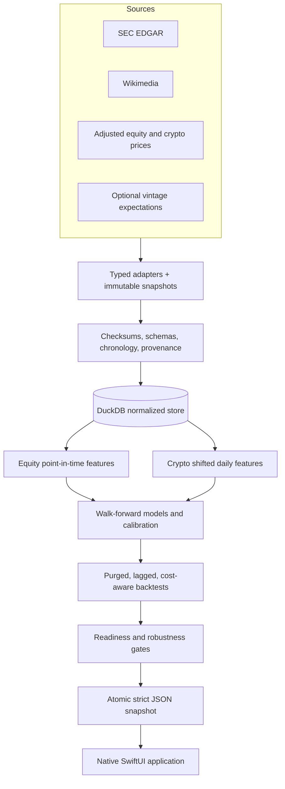
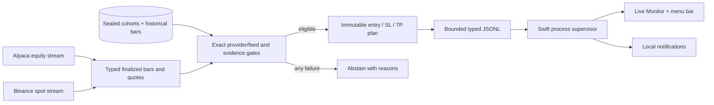

# Architecture

## Objective

Nowcaster separates acquisition, point-in-time reconstruction, modelling, backtesting, snapshot publication, and presentation. The native app cannot silently mutate research results; it consumes an exact, versioned contract generated by the engine.

## Python research engine

- `src/ingestion`: provider transport, frozen-source normalization, and checksum manifests.
- `src/validation`: schema, chronology, uniqueness, and cross-table quality issues.
- `src/database`: normalized SQLAlchemy schema and DuckDB repositories.
- `src/features`: equity cutoff-aware features and crypto one-bar-shifted predictors.
- `src/models`: fold-local preprocessing, ensembles, calibration, and abstention.
- `src/backtest`: purging, isolated final test, execution lag, costs, risk sizing, inference, and stability.
- `src/app_snapshot`: exact native DTOs and atomic snapshot publication.
- `src/pipeline`: deterministic stages with progress, configuration hash, Git revision, status, and row counts.

The equity and crypto subsystems share infrastructure but not economic assumptions. Revenue targets and event variants never enter crypto modelling.

## Native application

`macos/Nowcaster` is a Swift Package that assembles into `Nowcaster.app`.

- Models mirror the JSON contract and reject unsupported schema versions before payload decoding.
- `SnapshotRepository` performs strict decoding and keeps the last-known-good value.
- `AppModel` owns selection, search, destination, refresh, and job state.
- Feature views are native SwiftUI and Swift Charts; there is no web server or WebView.
- `EngineRunner` invokes Python with an executable URL and argument array, streams structured progress, supports cancellation, and reports non-zero exits.
- Accessibility summaries and tabular disclosure alternatives accompany quantitative charts.

The bundled snapshot is copied into application resources for a useful first launch. A rebuilt snapshot remains a local generated artifact.

## Live notification control plane

The optional Live Monitor is a separate, notification-only path:

`src/live_monitor` imports no trading or broker-order module. Credentials arrive as one private stdin bootstrap, stdout contains typed events only, and stderr is drained without displaying raw provider context. The engine restores active hypothetical setup state from DuckDB after restart. A signed release launches the exact bundled helper; source builds may use the configured Python executable.

## Contract and atomicity

The snapshot has a top-level schema version, metadata, instruments, earnings forecasts, signals, backtests, diagnostics, data-quality issues, and pipeline runs. Enum decoding is forward-compatible, but an unknown major schema is rejected. Python writes a temporary file, fsyncs where supported, validates it, and atomically replaces the published path so the UI never sees a partial JSON document.

## Operations and provenance

Every pipeline stage records its configuration hash, Git revision, timestamps, state, and counts. Derived evidence retains source/version metadata. Demo mode is fully offline after checkout; live adapters are explicit and use the same downstream validation. The Live Monitor never executes orders. Separately configured paper-trading modules remain isolated behind their existing risk controls, and real-money trading remains locked.

## Legacy boundary

The Streamlit directory remains temporarily for research-migration regression coverage. It is a deprecated read-only fallback, not the shipped product architecture.
