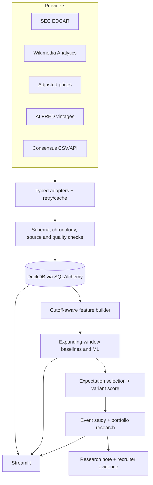

# Architecture

## Objective

The system separates data acquisition, point-in-time reconstruction, fundamental forecasting, expectation comparison, return analysis, and presentation so each claim can be audited independently.

## Boundaries

- `src/ingestion`: provider-specific transport and normalization. Raw snapshots remain source-labelled.
- `src/validation`: input and cross-table integrity rules. Quality issues are durable rows, not console-only warnings.
- `src/database`: normalized SQLAlchemy schema, DuckDB engine, and simple repositories.
- `src/features`: daily-to-quarter aggregation, growth transforms, cutoff construction, and explicit leakage assertions.
- `src/models`: baselines, fold-local pipelines, expanding folds, metrics, intervals, confidence, and explanations.
- `src/consensus`: historical estimate import, expectation proxy, as-of selection, and variant standardization.
- `src/backtest`: identical-date event returns, market/sector adjustment, inference, and constrained portfolio research.
- `src/reporting` and `dashboard`: read-only consumers of persisted evidence.

## Restartability and provenance

`Pipeline` executes a declared stage order. A successful `pipeline_runs` row is keyed semantically by stage, mode, and configuration hash, enabling safe reuse. Failures stop downstream stages and persist a concise error. Every model run includes Git revision, random seed, feature set, train/test boundaries, parameters, observations, and metrics.

## Demo and live modes

Demo mode is fully offline after checkout and uses bundled real SEC, Wikimedia, and price snapshots for three companies. It deliberately excludes latest-revised FRED files from historical features. Live mode uses the same downstream code but explicit network adapters and source labels; SEC/Wikimedia requests require an identifying user agent. Neither path includes order execution.

## Security and operations

Secrets are loaded from `.env`, which is ignored. HTTP data are cached under ignored directories. The database and reports are generated artifacts. The dashboard opens the configured DuckDB file through bounded queries. Production deployment would need authentication, licensed data, secrets management, observability, and separate compute/storage services.
