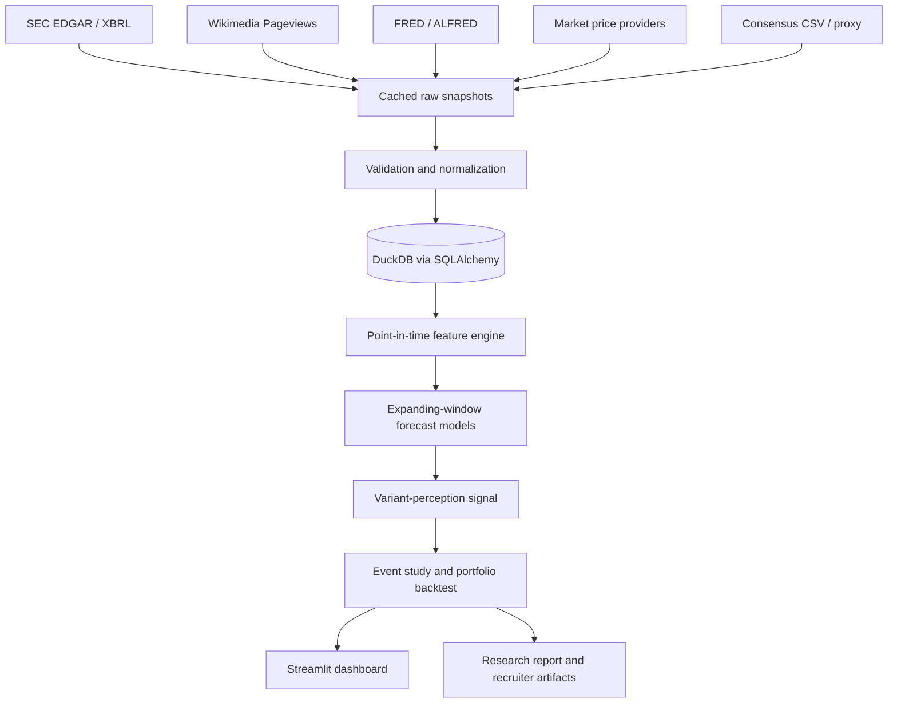

# Alternative-Data Earnings Nowcaster Design

## Purpose and research contract

The project tests whether legally obtainable, point-in-time alternative data improves pre-earnings quarterly revenue forecasts and whether a forecast's divergence from an expectation benchmark is associated with subsequent earnings-event returns. It treats three questions separately:

1. Can the system forecast quarterly company fundamentals?
2. Is the forecast materially different from a contemporaneous consensus estimate or a clearly labelled proxy?
3. Does that difference contain information about subsequent stock returns?

All visible results identify the data mode (`real`, `demo_real_snapshot`, or `synthetic_test_fixture`), consensus mode (`actual_consensus`, `manual_consensus`, or `expectation_proxy`), retrieval time, forecast cutoff, sample size, and limitations. Synthetic data is confined to automated tests. Demo mode uses bundled, source-labelled snapshots of real public observations and never presents them as live.

## Project boundary

The application is a standalone nested project at `alternative-data-earnings-nowcaster/`. It has its own Git history and Python environment and does not modify Goldman Sachs' `gs_quant` source. The project may import offline-safe GS Quant time-series utilities through an optional adapter and uses them during validation to cross-check return and risk calculations. Core operation never requires Goldman Marquee credentials.

## Architecture



The CLI orchestrates explicit, restartable stages. Each stage reads durable upstream tables and writes versioned downstream results. Source clients own HTTP behavior; repositories own persistence; financial transformations, forecasting, and event calculations remain pure functions where possible. Dashboard pages query persisted results and never train models or issue network requests.

## Data-source posture

| Source | Cost/access | Core role | Point-in-time treatment |
|---|---|---|---|
| SEC `data.sec.gov` submissions and company facts | Free, no key; descriptive user-agent required | Company mapping, filings, standardized fundamentals | Filed/accepted date is `available_date`; amended facts are retained and deduplicated by accession and filing date |
| Wikimedia Analytics API | Free, no key; descriptive user-agent required | Brand/company attention proxy | Observation date plus one-day conservative availability lag |
| FRED/ALFRED API | Free API key | Macro and sector controls | ALFRED real-time periods/vintages determine availability; current revised FRED values cannot masquerade as historical vintages |
| Bundled macro snapshot | Free, no runtime key | Keyless demo | Snapshot includes source, retrieval time, and conservative release dates |
| Stooq-compatible daily CSV provider | Free, no key, no SLA | Default live price route | Adjusted/raw semantics stored explicitly; provider failures do not silently fall back |
| Alpha Vantage | Optional free/keyed or paid tier | Optional price provider | Provider metadata and adjustment fields retained |
| Manual price CSV | User supplied | Reproducible fallback | Schema validation and source label required |
| Google Trends | Optional/manual CSV or experimental adapter | Search-interest features | Disabled by default because there is no stable unrestricted official API for arbitrary queries |
| Consensus CSV | User supplied, usually paid data exported manually | Historical expectations | `as_of_date <= forecast_cutoff_date` is mandatory |
| Expectation proxy | Free and generated internally | Demo/research fallback | Labelled `expectation_proxy`; never called Wall Street consensus |

Paid app-ranking, web-traffic, footfall, and institutional-estimate providers are extension interfaces only. No core or demo command requires them.

HTTP clients use identifiable user agents, exponential backoff with jitter, `Retry-After`, bounded concurrency, per-host throttles, file caches, retrieval manifests, structured logs, and explicit failure records. SEC traffic is limited below the SEC's published ceiling; the project default is two requests per second.

## Initial universe

The checked-in universe contains SBUX, NKE, LULU, CMG, MCD, TGT, WMT, COST, HD, LOW, ABNB, BKNG, UBER, and DASH. Each entry stores ticker, CIK, company name, sector ETF, Wikipedia article, search terms, fiscal-year-end metadata, and an enabled flag. Data-quality gates can exclude an issuer-quarter without deleting the issuer from configuration.

The bundled demo uses a smaller subset selected only after confirming sufficient sourced observations. Universe size shown in reports always comes from persisted data rather than the configuration count.

## Data model

All tables include `created_at`, `source`, and `source_version` where relevant. Derived tables include a deterministic transformation version or model-run identifier.

### Core tables

- `companies`: `company_id`, ticker, CIK, name, sector, sector ETF, fiscal-year-end month, active flag.
- `financials_quarterly`: company, fiscal year/quarter, period start/end, filed/accepted dates, accession, form, taxonomy/tag, revenue, operating income, net income, diluted EPS, diluted shares, unit, amendment flag, quality status.
- `company_kpis`: company, KPI name, fiscal quarter, value/unit, period end, available date, accession, extraction method, source evidence.
- `earnings_calendar`: company, fiscal quarter, event date/time, timing confidence, source, available date.
- `market_prices_daily`: symbol, trading date, raw close, adjusted close, volume, currency, adjustment status.
- `alternative_data_daily`: company, signal, observation date, available date, value, unit, provider dimensions.
- `macro_data`: series, observation date, available date, vintage date, value, unit.
- `features_quarterly`: company, fiscal quarter, cutoff date, horizon days, feature name/value, feature family, maximum input available date, transformation version.
- `forecasts`: run, company-quarter, cutoff/horizon, model, ablation, target and revenue forecasts, prediction interval, status, explanation payload.
- `consensus_estimates`: company-quarter, as-of date, revenue/EPS estimate, analyst count, mode and source.
- `variant_signals`: forecast, expectation, raw variant, cross-sectional z-score, bucket, confidence score and confidence components.
- `model_runs`: run identifier, timestamp, Git commit, seed, model parameters, features, train/test windows, observation counts, metrics and status.
- `backtest_results`: signal/event/window, raw/benchmark/sector-adjusted returns, portfolio weights, costs, liquidity status.
- `data_quality_issues`: stage, entity key, severity, rule, observed value, message, source and detection time.
- `pipeline_runs`: command, mode, start/end, config hash, Git commit, row counts, status and error summary.

Natural keys receive unique constraints; surrogate identifiers support stable joins. SQLAlchemy Core defines portable tables, while repository methods isolate DuckDB-specific upserts so PostgreSQL can replace it later.

## Point-in-time rules

Every source record has an `observation_date` and `available_date`. Every prediction has an `earnings_date` and `forecast_cutoff_date`, with horizons of 30, 14, 7, and 1 calendar days by default. A record is eligible only when `available_date <= forecast_cutoff_date`.

Fundamentals become available on SEC filing/acceptance, not period end. Alternative observations receive provider-specific lags. Macro observations use vintage/release dates. Consensus selects the latest estimate no later than the cutoff. Prices after the cutoff are unavailable to features. Feature aggregation stores the maximum contributing availability date so leakage can be audited without reopening raw data.

`assert_no_lookahead` checks every materialized feature row and fails the pipeline on a violation. Tests also mutate future observations and prove historical matrices and predictions remain unchanged.

## Fundamental normalization

SEC company facts are normalized through a metric registry with issuer overrides. Revenue candidates include `RevenueFromContractWithCustomerExcludingAssessedTax`, `SalesRevenueNet`, and documented issuer-specific tags. Selection requires the correct unit, duration, form, fiscal period, and accession. Year-to-date facts are converted to standalone quarters only when the components tie. Duplicate filings, amendments, restatements, instant-versus-duration mismatches, fiscal-calendar changes, and implausible signs create explicit quality flags.

Normalization retains the selected tag and accession so every value is traceable. A manually reviewed fixture pack for representative calendar and non-calendar fiscal issuers supplies integration checks.

## Feature methodology

Primary target is `log(revenue_t / revenue_t-4)`. Reported revenue is reconstructed from the forecasted growth and the latest eligible year-ago revenue. The feature engine produces long-form auditable rows and a model-ready wide matrix.

Feature families include:

- Fundamentals: lagged YoY/QoQ revenue growth, operating margin, EPS growth, seasonal quarter indicators, and company fixed effects.
- Attention: quarter-to-date and trailing-28-day pageview growth, momentum, seasonal z-score, maximum, and company-versus-universe relative attention.
- Search: the same transformations when an approved provider or manual import is available.
- Macro: point-in-time retail sales growth, CPI/inflation, unemployment, consumer sentiment, gasoline prices, rates, and disposable-income growth, limited to economically justified series.
- Company KPIs: modular lagged features with issuer-specific definitions and minimum-history checks.

Missingness flags accompany imputed values. Imputation is learned on each training fold only. Features with insufficient historical coverage are excluded by deterministic thresholds recorded in the run.

## Forecasting and validation

Models are fitted separately for each cutoff horizon and ablation:

1. Seasonal naive using year-ago revenue with a trailing eligible growth adjustment.
2. Historical growth benchmark using recent QoQ, YoY, and seasonality.
3. Linear fundamentals-only model.
4. OLS with configured alternative-data features and company controls.
5. Ridge and Elastic Net pipelines with fold-local scaling and imputation.
6. HistGradientBoostingRegressor as the single nonlinear model, subject to sample-size gates.

Pooled models are the default because individual issuers have limited quarterly history. Company-specific baselines are always retained; company-specific learned models run only when the configured minimum number of training quarters is met.

Validation is expanding-window and produces one forecast per historical company-quarter. No random train/test split is permitted. Model selection uses only training-era inner time-series folds. Metrics include MAE, RMSE, valid MAPE, revenue-growth acceleration direction, error versus seasonal baseline, and coverage. Comparisons include fundamentals-only, alternative-only, fundamentals-plus-alternative, and fundamentals-plus-alternative-plus-macro ablations. Random seeds are fixed and every prediction remains stored at company-quarter level.

Confidence is a calibrated research score, not a probability of profit. It combines residual uncertainty, interval width, data completeness, extrapolation distance, model agreement, and training sample size. The dashboard explains these components.

Linear forecasts expose standardized coefficients and per-feature contributions. The tree model exposes permutation importance; SHAP remains optional and is not required for the core environment.

## Expectations and variant signal

`ConsensusProvider` exposes a typed interface implemented by CSV import and future keyed providers. The default demo builds an expectation proxy from forecasts generated exclusively from historical reported fundamentals. Proxy records carry a permanent `expectation_proxy` label.

Revenue variant equals `(model revenue forecast - expectation revenue) / expectation revenue`. Z-scores use only the contemporaneous cross-section available for that historical cutoff. Quantile buckets degrade gracefully when the cross-section is too small and report actual counts. The variant signal is persisted as of the cutoff before event returns are joined.

## Event study and portfolio backtest

Event windows are `[-1,+1]`, `[0,+1]`, `[0,+3]`, and `[0,+5]` trading days. Calculations use explicit trading calendars inferred from available price rows, adjusted closes, and an unambiguous close-to-close convention documented beside every output.

Each event stores raw, SPY-adjusted, and sector-ETF-adjusted returns. Reports compare top and bottom variant buckets using mean, median, hit rate, standard deviation, t-statistic, sample count, bootstrap confidence interval, and Newey-West inference where dependence warrants it. Cross-sectional regressions include horizon and time controls only when sample size supports them. Multiple-testing risk and low-power slices are displayed rather than hidden.

The optional market-neutral portfolio goes long the highest positive variants and short the most negative, equal weighted with maximum weights, liquidity filters, overlap handling, 10-basis-point one-way default costs, and configurable slippage. It reports cumulative return, meaningful CAGR, volatility, Sharpe, drawdown, hit rate, turnover, gross/net exposure, and observation count. No result is described as alpha without robust evidence.

## Dashboard

Streamlit uses six pages:

1. Overview: research posture, universe/history, freshness, observations, best eligible model, baseline/model errors, incremental improvement.
2. Company Research: reported fundamentals, point-in-time signals, actual versus predicted revenue, errors, coefficients/contributions and evidence.
3. Forecast Monitor: sortable forecast, expectation, variant, z-score and confidence table with mode badges.
4. Model Performance: folds, horizon/issuer results, rolling error, ablations, importance and sample counts.
5. Event Study: bucket returns, cumulative event paths, confidence intervals, spreads and robustness caveats.
6. Data Quality: missing/stale/failed inputs, exclusions, rule failures and refresh status.

Pages show an explicit banner for demo, stale, proxy-consensus, or insufficient-evidence states. Empty data produces actionable instructions rather than fabricated cards.

## Reporting and recruiter artifacts

`report` produces `reports/latest_research_report.md` with the eleven requested sections and an automatically selected large-variant historical case. `reports/resume_bullets.md` contains three alternatives generated only when required measured fields exist; otherwise it explains which run is missing. `docs/interview_guide.md` covers the methodology and fifteen difficult interview questions. The README includes setup, macOS instructions, architecture, commands, screenshots generated from the demo dashboard, source posture, measured results, limitations, and the research-only disclaimer.

Recruiter statistics are queried from persisted successful real/demo runs. Narrative generation uses templates and never invents values.

## CLI and operational behavior

The project supports both `python -m src.cli <command>` and a `nowcaster <command>` console entry point. Commands are `init-db`, `fetch-fundamentals`, `fetch-prices`, `fetch-altdata`, `build-features`, `train`, `backtest`, `report`, `run-all`, and `demo`. `make demo` rebuilds the demo database and all downstream artifacts from bundled real snapshots. `make dashboard` launches Streamlit against that database.

Every command returns a nonzero exit code on material failure, records a pipeline run, and prints one concise result or remediation message. Structured JSON logs go to `logs/`; human console logs default to INFO.

## Repository structure

```text
alternative-data-earnings-nowcaster/
├── README.md
├── pyproject.toml
├── Makefile
├── .env.example
├── .gitignore
├── config/
├── data/{raw,processed,cache,demo}/
├── dashboard/app.py
├── docs/
├── notebooks/
├── reports/
├── scripts/
├── src/
│   ├── cli.py
│   ├── config/
│   ├── database/
│   ├── ingestion/
│   ├── validation/
│   ├── features/
│   ├── models/
│   ├── consensus/
│   ├── backtest/
│   ├── reporting/
│   └── utils/
└── tests/{unit,integration}/
```

Core logic stays out of notebooks. Three small notebooks illustrate exploration by importing package functions.

## Dependencies and macOS support

Python 3.11 through 3.13 is supported initially. Python 3.14 is not claimed until the scientific stack supports it consistently. Runtime dependencies are pandas, NumPy, HTTPX, SQLAlchemy, duckdb-engine, DuckDB, statsmodels, scikit-learn, SciPy, Plotly, Matplotlib, Streamlit, Pydantic, PyYAML, python-dotenv, Typer, tenacity, and platformdirs. Test dependencies include pytest, pytest-cov, responses/respx, and freezegun.

The README covers Xcode command-line tools, Homebrew only as an optional Python installation route, `python3 -m venv`, editable installation, `.env`, Apple Silicon and Intel behavior, and common compilation issues. `.env`, virtual environments, databases, caches, raw downloads, logs, notebook checkpoints, and `.DS_Store` are ignored.

## Testing strategy

Unit tests use synthetic miniature fixtures and no network. They cover SEC tag selection and parsing, standalone-quarter derivation, fiscal mapping, point-in-time joins, feature aggregation, revenue growth, database constraints/upserts, each forecast formula, variant construction, event and abnormal returns, transaction costs, missing-data policy, confidence scoring, report truthfulness, and configuration validation.

Integration tests use recorded small public responses and temporary DuckDB files to cover SEC ingestion, Wikimedia ingestion, price CSV ingestion, end-to-end demo, CLI behavior, migrations/schema initialization, and dashboard query contracts. Leakage tests enforce availability invariants and future-data mutation stability. Numerical tests cross-check selected return/statistics outputs against GS Quant when locally importable while retaining deterministic reference assertions.

Completion verification runs formatting/lint checks, the full test suite with coverage, `make demo`, all CLI smoke commands, report content assertions, DuckDB table/row audits, Streamlit startup health, and screenshot-based visual inspection of all six pages.

## Delivery order

Implementation follows the twelve phases in the requested specification. Each phase ends with tests and a working CLI increment. Stretch goals are excluded until every core definition-of-done artifact is verified. The first complete release prioritizes two reliable alternative-signal families—Wikimedia attention and point-in-time macro controls—while retaining the search-interest provider interface and manual import path.

