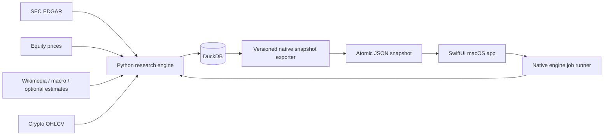

# Native macOS Nowcaster Design

## Product contract

Nowcaster becomes a native macOS research workstation for monitoring equities and crypto, producing point-in-time research signals, and evaluating those signals with reproducible walk-forward backtests. The application helps a technically sophisticated user answer four questions:

1. What changed in the monitored universe?
2. Where does a model materially disagree with the expectation observable at that time?
3. How strong and well-supported is that disagreement?
4. Did the same decision rule survive realistic out-of-sample testing?

The app never describes confidence as a probability of profit and never promises profitable long/short calls. It can recommend `long research`, `short research`, or `abstain`, while exposing the evidence, assumptions, invalidation criteria, and model-risk warnings behind that posture.

## Chosen architecture

The product uses a native SwiftUI client and retains the Python quantitative engine.

This boundary preserves pandas, scikit-learn, statsmodels, and DuckDB for research while giving the user a real macOS application. Swift never opens DuckDB directly and Python never owns UI state. A versioned JSON contract isolates both sides and makes fixtures easy to test.

Alternatives rejected:

- Rewriting analytics in Swift would sacrifice mature scientific tooling and create numerical parity risk.
- Wrapping Streamlit in a web view would remain a website and would not meet macOS interaction or accessibility expectations.

## Deployment and compatibility

- Swift 6.3 and the macOS 26 SDK are used for development.
- The deployment target is macOS 15.0 so Apple Silicon and recent Intel Macs can run the app.
- SwiftUI, Swift Charts, Observation, Foundation, and AppKit bridges are the only runtime frameworks.
- The interface adopts current system materials and Liquid Glass behavior when available rather than drawing a custom imitation.
- The project is a Swift Package that Xcode can open directly. A deterministic build script assembles `Nowcaster.app`, writes its property list, copies resources, and applies ad-hoc signing by default.
- Optional Developer ID signing and notarization are controlled by CI secrets and never hard-coded.

## Native engine bridge

### Snapshot contract

`nowcaster export-app-snapshot` writes `data/app/nowcaster-snapshot.json` atomically. The document contains:

- schema version, generated timestamp, Git revision, data mode, and source posture;
- overview counts, freshness, pipeline state, warnings, and measured headline results;
- instruments and daily prices for equity and crypto watchlists;
- earnings forecasts, expectation variants, confidence components, and explanations;
- research signals with posture, horizon, strength, catalyst, invalidation, and eligibility;
- model performance by horizon/fold/ablation;
- portfolio and event backtest summaries, equity curves, drawdowns, monthly returns, and sensitivity results;
- data-quality issues, source coverage, and pipeline history.

The exporter validates its payload against Pydantic models before an atomic temporary-file rename. Unsupported schema versions produce a native recovery screen instead of partially rendering data.

### Job runner

The app discovers the project root automatically when launched from the repository and lets the user choose a different engine location in Settings. It invokes the configured Python executable with `Process`, streams structured progress events, supports cancellation between pipeline stages, and refreshes the snapshot after a successful job. It never interpolates shell input or executes through a shell.

Jobs include:

- refresh demo;
- refresh market data;
- rebuild features;
- retrain models;
- run complete backtest;
- export snapshot.

The first-launch experience checks engine health, snapshot compatibility, and required files. Missing Python dependencies produce a one-click copyable remediation command, not a crash.

## Information architecture

The main window uses `NavigationSplitView` with a collapsible sidebar, content column where a collection benefits from selection, and detail column. It supports multiple windows for instrument research and backtest comparison.

Sidebar groups:

- **Monitor:** Today, Markets, Earnings, Signals.
- **Research:** Instrument Research, Backtests, Model Lab.
- **System:** Data Quality, Pipeline Runs.

The toolbar contains navigation title, global instrument search, data-mode status, last refresh, refresh action, and an overflow menu. Commands are also available from the menu bar and keyboard.

### Today

The opening view answers “what needs attention?” It shows freshness and source posture first, then eligible signals, upcoming equity events, unusual market moves, and recent model or data warnings. Empty states distinguish no signal from missing data.

### Markets

A native sortable `Table` shows symbol, asset class, last price, daily/weekly return, realized volatility, trend regime, data freshness, and watchlist status. Selecting a row opens a detail with an accessible Swift Chart, period picker, scrubber, volume, and sourced signal history.

### Earnings

Equity-only. A master table shows company, fiscal quarter, event basis, cutoff, horizon, model forecast, expectation, variant, model uncertainty, and eligibility. Detail compares forecast, expectation, and actuals; explains feature contribution and coverage; and makes proxy consensus unmistakable.

### Signals

Signals are ranked by evidence-adjusted strength, not raw model score. Each signal uses one of three postures: `long research`, `short research`, or `abstain`. A signal detail shows:

- security and asset class;
- research horizon and event/catalyst;
- measured edge and confidence interval;
- calibrated directional probability only when calibration is valid;
- model agreement and data completeness;
- estimated trading frictions;
- thesis, evidence, invalidation, and kill criteria;
- nearest historical analogues;
- reasons the signal may be ineligible.

Positive and negative direction never rely on color alone.

### Backtests

Backtests display a compact verdict, train/validation/test windows, strategy definition, assumptions, headline metrics, equity curve, drawdown, rolling Sharpe, exposure, turnover, monthly return matrix, fold stability, parameter sensitivity, and bootstrap distributions. The final untouched test segment is visually separated from model-development periods. Results with insufficient sample, unstable parameters, or failed cost assumptions receive an explicit `not decision-ready` posture.

### Model Lab

Model Lab compares baselines, feature ablations, horizons, fold errors, calibration, feature stability, and extrapolation. It is diagnostic and cannot mutate historical evidence. Training controls start a new versioned run.

### Data Quality and Pipeline Runs

These screens provide source provenance, hash verification, freshness, exclusions, missingness, chronology failures, job logs, run duration, configuration hash, and Git revision. Users can reveal generated artifacts in Finder.

### Settings

The standard macOS Settings scene contains engine path, Python executable, snapshot path, watchlists, refresh preferences, cost assumptions, appearance/accessibility preferences, and optional provider keys stored through Keychain-backed environment configuration. Secrets are never written to the snapshot.

## Apple design and accessibility rules

- Use system typography, spacing, controls, menus, sheets, inspectors, tables, toolbars, sidebars, and semantic materials.
- Use the user’s accent color. Fixed direction colors appear only where meaning requires them.
- Avoid dashboard-card grids as the default composition; use grouped sections, tables, disclosure, and inspectors to achieve macOS information density.
- Keep window title contextual rather than repeating the product name.
- Support sidebar visibility commands, toolbar customization where useful, full-screen mode, window restoration, and multiple windows.
- Provide menu equivalents and keyboard shortcuts for refresh, search, backtest, export, and navigation.
- All charts provide a plain-language summary, accessibility labels, accessible chart descriptors, keyboard/scrubber interaction, and a tabular alternative.
- Support VoiceOver, Full Keyboard Access, increased contrast, Reduce Transparency, Reduce Motion, and system text scaling.
- Never encode direction, quality, or failure with color alone; pair color with symbols and text.
- Minimum window size is 1,080×720, but layouts remain useful when narrower through automatic sidebar/content collapse.

## Equity research improvements

The equity nowcast keeps earnings forecasting, expectation divergence, and subsequent returns as separate labels.

- Forecast the log year-over-year revenue ratio and reconstruct positive revenue, preventing impossible negative forecasts.
- Fit models independently by horizon.
- Make labels trainable only after the reported-result availability time.
- Add fold-local winsorization, missingness indicators, robust scaling, and deterministic feature-coverage gates.
- Add a weighted ensemble of eligible Ridge, Elastic Net, and gradient-boosting models; weights come only from prior folds.
- Add rolling residual calibration and conformal intervals where sample size permits.
- Add evidence-adjusted abstention based on interval width, model disagreement, missingness, extrapolation, and minimum sample.
- Keep actual historical consensus as an optional import. Seasonal proxy estimates remain visibly labelled and cannot generate a `decision-ready` posture.

## Crypto research subsystem

Crypto is implemented as a separate daily time-series research problem because it has no earnings event or fundamental expectation benchmark.

Initial supported instruments are BTC-USD and ETH-USD, with configuration-based extension. Features include lagged returns, moving-average distance, realized volatility, volatility-of-volatility, volume trend, RSI-style bounded momentum, drawdown, BTC-relative return for alt assets, and equity/crypto risk regime where available.

Models predict next-period direction and risk-adjusted return over configurable 1-, 5-, and 20-day horizons. Baselines include no-position, time-series momentum, and moving-average trend. Learned models include regularized logistic regression and histogram gradient boosting, gated by sample size. Crypto signals use the same calibrated-abstention posture as equities and never inherit earnings terminology.

## Backtest methodology

### Walk-forward protocol

- Sort by the decision timestamp and preserve the complete information set available then.
- Reserve the most recent 20% of eligible time as a final untouched test segment.
- Use expanding outer folds in the remaining period.
- Use purged inner time-series folds for model and hyperparameter selection.
- Apply an embargo equal to the prediction or event horizon when labels overlap.
- Fit imputation, scaling, winsorization, selection, calibration, and ensemble weights only on each training fold.
- Deduplicate equity company-events before portfolio aggregation and use one declared model/horizon selection policy.

### Portfolio simulation

- Equity event strategy: rank eligible expectation variants, take balanced top/bottom legs only when both exist, cap issuer weights, neutralize market and sector exposure where data support it, and hold for the declared event window.
- Crypto strategy: use volatility-targeted long/flat or long/short positions with one-bar execution lag and capped leverage.
- Apply bid/ask spread, commissions, slippage, short borrow estimates, and turnover costs. Costs are configurable and sensitivity-tested.
- Prevent simultaneous overlapping positions from exceeding gross/net exposure limits.

### Evidence and robustness

Persist and display CAGR where meaningful, cumulative and annualized return, volatility, Sharpe, Sortino, Calmar, maximum drawdown, hit rate, profit factor, turnover, exposure, trade count, average holding period, and capacity warnings.

Inference includes event/date block bootstrap, HAC or date-clustered errors, confidence intervals, false-discovery-rate correction across declared comparisons, and deflated Sharpe diagnostics. Parameter sensitivity, subperiods, asset/issuer leave-one-out tests, cost stress, and regime splits are first-class outputs. A strategy is `decision-ready` only when it clears configured minimum sample, stability, cost, and untouched-test gates.

## Persistence changes

New or extended tables include:

- `instruments` with asset class and provider identifiers;
- `market_signals_daily` for crypto and non-event market features;
- `research_signals` with posture, eligibility, confidence components, catalyst, and invalidation;
- `backtest_runs` with strategy specification, split boundaries, assumptions, metrics, and readiness;
- `backtest_equity_curve`, `backtest_positions`, and `backtest_sensitivity`;
- `calibration_results` and `model_diagnostics`.

Natural keys and provenance remain mandatory. Existing schema remains readable through explicit migration/version checks.

## Error handling and security

- Snapshot writes are atomic and validated.
- Engine jobs expose structured progress, cancellation, and concise recovery instructions.
- Failed refreshes preserve the last known-good snapshot and display staleness.
- File access uses explicit user-selected paths and security-scoped bookmarks when sandboxed.
- Provider credentials remain outside Git, DuckDB exports, logs, and native snapshots.
- All process arguments are passed as arrays without a shell.
- The app contains no brokerage connection or order-execution capability.

## Testing and QA

### Python

- Unit tests for target transforms, purging/embargo, ensemble weighting, calibration, abstention, crypto features/models, portfolio accounting, cost stress, statistics, payload schema, and migrations.
- Integration tests for full equity and crypto demo pipelines, deterministic exports, CLI jobs, restartability, source truthfulness, and leakage mutation.
- Golden numerical fixtures for returns, drawdowns, and fold boundaries.

### Swift

- Swift Testing unit tests for snapshot decoding, schema rejection, formatting, filtering, signal eligibility, settings, engine arguments, progress parsing, and view-model state.
- Integration tests launch a fixture engine and verify refresh, cancellation, last-known-good behavior, and snapshot reload.
- UI tests cover sidebar navigation, global search, tables, filters, settings, keyboard commands, empty/error states, and accessibility identifiers.

### Visual and accessibility QA

- Build and launch the real `.app` rather than preview-only views.
- Capture every primary screen in light and dark appearance at representative window sizes.
- Inspect hierarchy, spacing, clipping, toolbar behavior, window resizing, table density, chart legibility, empty states, and system-material behavior.
- Run Accessibility Inspector audits and verify VoiceOver labels, keyboard navigation, reduced motion, increased contrast, and chart tabular alternatives.

## Repository and delivery

- The native app lives under `macos/Nowcaster/` with `Sources`, `Tests`, `UITests`, `Resources`, and build scripts.
- Streamlit is removed from the default product path. Its data-query tests may remain temporarily as migration coverage, but the README and primary commands launch the native app.
- `make macos-build`, `make macos-test`, `make macos-app`, and `make macos-open` provide deterministic local workflows.
- GitHub Actions runs Python lint/tests/demo verification and Swift build/tests on macOS.
- A release workflow assembles a zipped `.app`, generates checksums, and uploads workflow artifacts. Signing/notarization activates only when repository secrets are present.
- After all verification, the repository is pushed to `https://github.com/james8464/nowcaster.git` with `main` as the default branch.

## Definition of done

1. A native, resizable, accessible SwiftUI application launches and operates against real generated research snapshots.
2. Equity and crypto workflows are distinct, honest, and fully represented in the UI.
3. The Python engine exports a versioned contract and can be safely run from the app.
4. The enhanced walk-forward backtests persist complete portfolio, robustness, sensitivity, and readiness evidence.
5. Python, Swift, integration, UI, leakage, snapshot, build, and smoke tests pass.
6. The `.app` bundle builds, launches, is visually inspected, and contains no web view or local web server dependency.
7. Documentation explains installation, architecture, signal interpretation, backtest assumptions, limitations, and signing.
8. GitHub Actions is valid and the complete verified repository is pushed to `james8464/nowcaster`.
