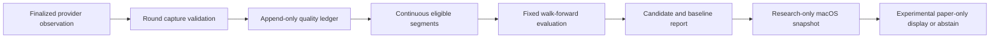

# Research Round 2: Reliable Data and Walk-Forward Research

## Purpose

Research Round 2 is a new, separately identified paper-only protocol for testing whether a small set of liquid crypto strategies has evidence worth further study. Its purpose is to improve the honesty and reproducibility of research evidence, not to promise profit, recommend a trade, send an order, or alter the frozen prospective study.

## Fixed scope and non-goals

- The existing `study-001-20260908`, its collector, evidence, rules, gaps, and reports are immutable and out of scope.
- The initial universe is Binance spot `BTCUSDT` and `ETHUSDT`. Spot shorts remain unsupported; a future short-capable venue needs its own protocol and provider contract.
- The round records its own immutable protocol manifest, candidate registry, data-quality ledger, selected candidates, failures, and reports in a new directory.
- No credentials are required or stored. The design must support a future user-supplied premium-provider adapter, but it must be disabled unless explicitly configured and must never put secrets in source, logs, snapshots, or command arguments.
- The macOS app may display the round as research status and experimental paper-only observations. It must not turn the results into a qualified alert, an order, or a personal trade recommendation.

## Design choice

Use a separate round with one provider-neutral capture contract, fail-closed quality gates, and sealed chronological walk-forward trials. This is preferable to tuning the current strategies against their incomplete live sample: it preserves the original evidence and prevents retrospective selection from being represented as prospective proof.

## Architecture

### 1. Immutable round manifest

`ResearchRoundProtocol` defines the unique round identifier, source revision, symbols, provider/feed identities, declared costs, bar interval, data-quality thresholds, chronological windows, strategy-candidate inventory, and promotion thresholds. It validates explicit UTC timestamps, a positive chronological schedule, supported spot directions, unique symbols, and a stable canonical hash.

`ResearchRoundRegistry` writes the manifest once and refuses a restart when the requested protocol hash differs. It appends candidate trials and provider-health events rather than overwriting them. A report always exposes the protocol hash, run state, and every exclusion reason.

### 2. Data capture and quality ledger

`RoundMarketObservation` accepts only finalized bars or quote observations that identify provider, feed, symbol, provider time, receipt time, availability time, and an immutable source key. Ingestion rejects malformed chronology, duplicate source keys with conflicting values, nonpositive prices, clock regression, unexpected interval, and bars unavailable by their decision time.

`DataQualityGate` builds contiguous segments and records gaps, latency, stale quotes, provider errors, reconnects, crossed/invalid books, and observed spread. Missing data is never reconstructed for a completed round. A candidate is excluded if its relevant evaluation period fails the declared coverage, freshness, continuity, spread, or liquidity thresholds. Provider errors make the round abstain until a later continuous segment has accumulated its required warm-up data.

The initial public Binance adapter is a research data source only. A `PremiumProviderAdapter` protocol defines the future integration boundary, including source identity and provenance requirements, but includes no provider credentials or fallback that disguises a public feed as premium data.

### 3. Sealed walk-forward evaluation

Each candidate receives fixed, chronologically ordered train, validation, and sealed test windows. Parameters may be selected only from the train window; selection thresholds may be set only from validation; the sealed test window is evaluated once per protocol hash and cannot feed back into selection. Evaluation requires finalized, causally available observations, next-observation execution, declared fees/spread/slippage/latency, conservative stop-before-target ordering, participation limits, and a no-trade outcome when execution cannot be established.

The report compares every candidate against hold, cash/no-trade, and direction-matched baselines. It includes raw and stressed net returns, lower confidence bound, trade count, drawdown, costs, coverage, provider health, data exclusions, and per-fold outcomes. It retains all candidates, including failures and duplicates, so a post-hoc winner cannot be presented alone.

### 4. Conservative research status

A candidate can be `insufficient_data`, `rejected`, or `experimental_paper_only`; it cannot become `qualified` in this round. `experimental_paper_only` requires all predeclared data-quality gates, positive lower net edge after doubled costs across every nonsealed selection fold, a positive sealed-test lower net edge, enough independent trades, acceptable drawdown, and no data-quality exclusion. Passing this label means only that the recorded gates passed; the UI copy must say it is not proof of profitability or advice.

An app-facing `ResearchRoundSnapshot` exposes current provider health, coverage, candidate status, reasons, and bounded experimental observations. It must distinguish an unavailable signal from an abstention, display the provider and last successful observation, and keep experimental results separate from promoted live-monitor setups.

### 5. Trend Advisor (paper-only posture)

`TrendAdvisor` is a separate, explanatory view over a retained `experimental_paper_only` candidate and its finalized causal observations. It may show **Long research posture**, **Short research posture**, or **Stand aside** together with a timeframe, bounded entry zone, invalidation level, research target levels, expiry, close conditions, and machine-readable reason codes. These are simulated research parameters derived deterministically from the hash-bound candidate barriers and finalized market state; they are not orders, personalised advice, an alert lifecycle, or a promise of profit.

The initial Binance spot protocol can only produce Long research posture or Stand aside. A requested short posture must fail closed to Stand aside with `spot_short_unsupported`; a short-capable venue requires a separately registered protocol, source contract, cost model, and replay evidence. The advisor requires a clean quality segment, a retained experimental candidate, and aligned finalized trend evidence (directional moving-average slope, trend-strength threshold, realised volatility/liquidity bounds, and candidate confirmation). Any unavailable, stale, gapped, contradictory, or weak condition produces Stand aside. It must never infer a trend from an unfinished bar, revise a published posture after the decision timestamp, or create a posture from a candidate rejected by the sealed evaluation.

The app keeps advisor output visibly separate from Live Monitor and labels it "Paper-only trend research — not a trade instruction." It records the round/protocol/candidate identity, decision and availability times, source identity, quality reasons, and close/invalidation reason codes so that a user can replay each posture causally. A future alert or execution capability is explicitly out of scope.

## Data flow

## Failure handling

- A transport error, stale feed, invalid bar, excessive spread, insufficient depth, clock regression, or gap produces an explicit reason and abstention; it never substitutes a favorable later observation.
- An unavailable premium adapter remains visibly unavailable. The public adapter remains correctly identified and cannot satisfy a premium-source requirement.
- A manifest/hash mismatch, altered strategy definition, changed cost model, changed source identity, or reused sealed test produces a new round requirement rather than silently continuing.
- No research result may write to the frozen study or change the normal qualified-alert lifecycle.

## Testing and acceptance criteria

The implementation must demonstrate all of the following:

1. Protocol and registry are deterministic, hash-bound, append-only, and reject changed restarts.
2. Data ingestion rejects future availability, clock regression, malformed bars, duplicate conflicts, gaps, stale observations, and wrong provider/feed/symbol/interval.
3. Walk-forward selection uses only prior data, runs each sealed test once, accounts for adverse execution and costs, and retains rejected candidates.
4. Data-quality exclusions prevent experimental observations even if historical returns are favorable.
5. The macOS snapshot parser rejects anything that tries to label a round candidate qualified or attach it to an order/alert lifecycle.
6. Trend Advisor emits a posture only for a causally available, quality-clean, experimental candidate; it emits Stand aside for spot shorts, gaps, stale data, weak/contradictory trend evidence, or rejected candidates.
7. Documentation explains that results are simulated research evidence, not a way to guarantee income.

## Success criteria

Research Round 2 is successful when the app can honestly show either a data-quality-blocked abstention or a fully traceable experimental paper-only result for a fixed protocol, without modifying the frozen study or overstating what the result means. Financial profitability is deliberately not an acceptance criterion because it cannot be guaranteed by software or backtesting.
